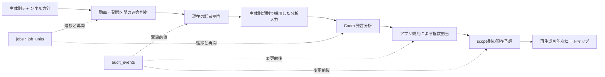

# M1 中核データモデルと処理状態 設計

## 状態

- 初回ユーザー承認日: 2026-08-14 JST
- 実装前レビュー統合案承認日: 2026-08-15 JST
- 対象: M1の設計成果物。M2最初のサブプロジェクトである中核バックエンドの境界
- 設計レビュー: 統合案はユーザー承認済み。書面反映版のユーザーレビュー待ち
- 次のゲート: この書面反映版のユーザーレビュー
- 設定済み入力: 江守哲は表示名「江守哲の米国株投資チャンネル」、正本YouTubeチャンネルID `UCVXka7buS_WptsAzSE0LcKg`
- 設定済み入力: 暁投資顧問の公式YouTubeチャンネルIDは `UCOfzLmXpI3qmZfV7_Cs1sYA`

## 目的

YouTube動画の取得、分割文字起こし、話者割当、主体別分析入力抽出、Codex分析、対象指数への自動割当、現在予想、ヒートマップを、修正・再分析・途中再開・削除が可能な形でSQLiteへ保存する。

次を同時に満たす。

- 話者処理と予想分析を別データとして扱う。
- 個人主体では聞き手と保留区間を本人の予想根拠へ混ぜない。暁投資顧問では、適合済み公式チャンネルの全発言を組織発言として扱う。
- 日付指定分析の入力と結果を再現可能にする。
- 同じ基準日の再分析は現在値を更新し、変更前後を監査する。
- 異なる基準日の分析結果は共存させる。
- 長時間CPU処理を5～10分単位で再開する。
- 本文データを期限後に削除しても、予想と監査情報を保持する。
- Web検索、現在相場、一般知識、shell、外部ツールをCodex分析へ混ぜない。
- 分析主体ごとのチャンネル範囲を、動画発見方法や話者判定とは独立して検査する。
- 元動画、切り抜き、Shorts、再投稿を重複排除せず、独立した出典として扱う。

## スコープ外

この設計では、次の実装詳細を確定しない。

- YouTube検索クエリと網羅性評価の具体的アルゴリズム。
- 採用する文字起こしエンジンと話者特徴モデルの最終製品選定。
- Codex prompt全文とJSON Schema全文。
- ヒートマップの最終的な色、余白、タイポグラフィ。
- Windows常駐プロセスのインストーラー。
- 複数音声モデル対応と共通の0～1スコア正規化。
- ローカルAPIのトークン、送信元検査、Windowsアカウント認証。
- 実価格を使う予想成績評価。

これらは独立した後続specで扱う。

## ローカルAPI境界

MVPのHTTP serverは `127.0.0.1` だけへbindし、ローカルトークン、`Origin`検査、Windowsアカウント認証を設けない。信頼できる単独利用PCを前提とし、同じPC上の別プロセスやブラウザからAPIへ到達される可能性を防ぐ認証境界ではない。loopback bindを機密性の保証とみなさず、状態変更APIへGETを使わない。このリスクを画面・運用資料へ明記し、追加認証と送信元検査はMVP外の後続specで扱う。

## 採用方式

### 現在値＋追記専用監査ログ

話者割当、同一分析scopeの正規化済み発言、指数割当、現在予想は、通常テーブルへ現在値を1件だけ保存する。修正時は、変更前JSON、変更後JSON、理由、操作者、日時を `audit_events` へ追記する。

話者割当の修正では、旧分析を自動的に新結果へ置き換えない。依存する分析scopeを `stale` にし、旧結果を警告付きで表示する。再分析が検証まで成功した場合だけ現在値を更新する。

ドメインテーブルの全行を版ごとに複製する方式と、動画全体の完全スナップショットを修正ごとに複製する方式は採用しない。現在検索を単純にし、全文文字起こしの重複も避けるためである。

### 変更不能なrun入力

実行中のCodex分析へ後から発言を追加しない。`analysis_run_segments` と `analysis_input_snapshots` をrun開始前に固定し、SHA-256を保存する。入力本文は保持期限後に削除できるが、hash、区間ID、出典、run設定、分析結果は残す。

## 責務境界

各境界の規則は次のとおり。

1. 動画・発話区間には予想方向を保存しない。
2. チャンネル適合判定と話者割当は別データにし、両方が適合した区間だけを分析候補にする。
3. 話者割当には市場見通しを保存しない。
4. 木野内栄治、江守哲、大川智宏のCodex入力は、本人割当かつチャンネル適合済みの区間だけに限定する。暁投資顧問は、固定公式チャンネルに適合した動画内の全区間を組織主体の入力にする。
5. Codexの指数候補と自己信頼度は提案として保存し、最終信頼度はアプリ規則で検査する。
6. ヒートマップは正本ではなく、現在予想から再生成できるキャッシュとする。

## 日付と時間

### 分析に使う日時

分析用の動画日時はYouTube公開日時 `published_at` だけとする。

- 通常動画はYouTubeメタデータの公開日時を使う。
- ライブ配信はYouTubeが公開する実際の配信開始日時を `published_at` として使う。
- 収録日時は保存せず、Codexやアプリに推測させない。
- システム内部の `created_at`、`updated_at`、job実行日時は障害調査にだけ使い、分析対象、相対期間、ヒートマップを変化させない。

### 日付指定分析

ユーザーが選択した日のJST 23:59:59を `cutoff_at_jst` とする。`published_at` がcutoff以前の動画だけを入力候補にする。システムが取得済みでも、公開日時がcutoffより後なら含めない。

### 相対期間

「今週」「来週」「来月」「半年後」などは `published_at` のJST日付から絶対日付範囲へ正規化する。

- 採用対象発言が具体的な年月・日付を述べた場合は明示期間を優先する。
- 採用対象発言で明示された年月日・期間には `time_basis = explicit_statement` を保存する。相対期間には `time_basis = published_at` と実際に使った公開日時を保存し、両者を混同しない。
- 相対期間のUIは「公開日基準」と絶対日付範囲を表示する。明示期間には「明示期間」と表示する。
- ユーザーが期間を修正した場合は、変更前後と理由を監査する。
- 防御可能な期間へ変換できない表現は `unknown_period` とする。未承認では主ヒートマップへ入れず、承認後は通常期間と別の「時期不明」列へ表示できる。

「何月第1週」は、その月の1日を含む月曜日から日曜日とする。月をまたいでも切らず、絶対日付範囲を保存・表示する。

時刻はDB内でUTCのISO 8601文字列として保存し、JSTへ変換して表示・日付範囲計算する。期間の開始日・終了日はJST暦日の `YYYY-MM-DD` とする。

## 論理エンティティ

実装はSQLiteを使い、ローカル単独利用のため内部主キーは `INTEGER PRIMARY KEY` とする。YouTube動画IDなど外部識別子には一意制約を付ける。

### 出典と文字起こし

#### `analysis_subjects`

- 分析主体の正規名、種別（個人・組織）、有効状態を保存する。
- 検索別名は子テーブル `subject_aliases` に保存する。
- 暁投資顧問は1つの組織主体とする。

#### `subject_channel_policies`

- 分析主体ごとに現在有効な収集・分析チャンネル方針を1件保存する。
- `policy_kind` は `all_channels` または `fixed_channel` とする。
- 木野内栄治と大川智宏は `all_channels`、江守哲と暁投資顧問は `fixed_channel` とする。暁投資顧問は公式チャンネルID `UCOfzLmXpI3qmZfV7_Cs1sYA` を固定対象にする。
- `configuration_status` は `configured` または `configuration_required` とする。`fixed_channel` を `configured` にする場合は正規の `youtube_channel_id` を必須にし、チャンネル表示名、ハンドル、入力URL文字列は正本にしない。
- 江守哲は確認用表示名「江守哲の米国株投資チャンネル」、`policy_kind = fixed_channel`、`configuration_status = configured`、固定ID `UCVXka7buS_WptsAzSE0LcKg` とする。固定IDはユーザー確認値であり、表示名から推定した値や検索結果へ自動変更しない。
- 暁投資顧問は `policy_kind = fixed_channel`、`configuration_status = configured`、固定ID `UCOfzLmXpI3qmZfV7_Cs1sYA` とする。固定IDはユーザー確認値であり、チャンネル表示名から推定した値へ自動変更しない。
- 方針または固定IDの変更は変更前後と理由を `audit_events` へ記録し、依存する分析scopeを `stale` にする。

#### `videos`

- `youtube_video_id`、タイトル、正規の `youtube_channel_id`、表示用チャンネル名、`published_at`、動画時間、ライブ区分を保存する。
- `youtube_video_id` は一意とする。
- 元動画、切り抜き、Shorts、再投稿は別動画として保存し、重複group、canonical動画、分析除外フラグを作らない。同じ内容でも各動画の発話を独立した根拠として数える。
- `recorded_at` と分析用の取得日は持たない。

#### `subject_video_eligibility`

- 分析主体と動画の組ごとに、チャンネル方針だけを評価した現在値を1件保存する。話者本人の出演確認とは別判定にする。
- 発見方法は `auto_search` または `manual_url`、判定は `eligible`、`channel_out_of_scope`、`configuration_required`、`channel_unresolved` とする。動画の正規チャンネルIDを解決できない場合もフェイルクローズにする。
- `fixed_channel` は、動画URLから解決した正規の `youtube_channel_id` と方針の固定IDが完全一致した場合だけ `eligible` にする。表示名一致や文字列URL一致では採用しない。
- 江守哲と暁投資顧問の自動検索は固定チャンネル内だけで行う。範囲外動画を自動検索の収集jobへ入れない。
- 手動URL登録は候補メタデータの保存経路であり、チャンネル方針の例外経路ではない。江守哲の他チャンネル動画は `manual_url` でも `channel_out_of_scope` のまま、音声取得、文字起こし、予想分析へ進めない。
- 動画単位の承認で `channel_out_of_scope` を覆せない。対象範囲を変える場合は `subject_channel_policies` 自体を監査付きで変更する。
- 判定時の方針ID・方針hash、動画チャンネルID、理由code、判定日時を保存する。

#### `transcription_chunks`

- 動画を5～10分の作業単位に分け、開始・終了ミリ秒、入力hash、処理状態、出力hashを保存する。
- 同じ動画内のchunk番号と時刻範囲を一意にする。

#### `transcript_segments`

- 動画、chunk、連番、開始・終了ミリ秒、本文、本文SHA-256、匿名話者IDを保存する。
- `start_ms < end_ms` を必須とする。
- 本文に `transcript_created_at`、`expires_at`、`text_deleted_at` を持たせる。
- 本文削除後は本文をNULLにするが、hash、時刻、出典、区間IDは残す。

#### `voice_reference_profiles`

- 個人主体について、対象者、参照声のモデル名・モデルバージョン、adapter版、特徴ファイルのhash、閾値設定バージョン、作成日時、有効状態を保存する。
- 実際の音声、埋め込み、特徴量はリポジトリ外の非公開領域に置く。
- MVPでは音声モデルを1種類に固定する。モデル横断の共通0～1正規化値は保存しない。

#### `speaker_assignments`

- 発話区間ごとに現在の割当を1件だけ保存する。
- `assignment_kind` は `subject`、`interviewer`、`hold` のいずれかとする。
- `subject` の場合だけ `assigned_subject_id` を必須にする。
- 参照声との生の照合値、話者処理engine、モデル名・バージョン、閾値設定バージョン、自動・手動、修正理由を保存する。生スコアを0～1に固定しない。
- 単純な2群クラスタリング結果だけで `subject` にしない。
- 閾値付近は `hold` にする。具体的なモデルと閾値値はM2の音声技術検証で確定する。
- 暁投資顧問は、適合済み公式チャンネル動画の全区間を `assignment_origin = channel_organization` として組織主体へ割り当て、聞き手・外部ゲストを除外しない。

### 分析scopeとrun

#### `analysis_scopes`

- `subject_id` と `cutoff_at_jst` の組を一意にする。
- 異なるcutoffの結果は別scopeとして共存する。
- `status` は `ready`、`running`、`current`、`stale`、`failed` を使う。

#### `analysis_runs`

- 同じscopeの初回実行、再試行、再分析を追記する実行記録である。
- modelは `gpt-5.6-sol`、reasoning effortは `max` を必須にする。
- prompt版、JSON Schema版、入力hash、開始・終了日時、run状態、外部ツール呼び出し件数、安全なerror codeを保存する。
- 下位モデルでの成功扱いを禁止する。
- 外部ツール呼び出し件数が0以外なら採用失敗とする。

#### `analysis_run_segments`

- runへ渡した発話区間と順序を固定する。
- 個人主体では、対応する `speaker_assignments.assignment_kind` が `subject` で、scopeの主体と一致する区間だけを許可する。暁投資顧問では、適合済み公式チャンネル動画の `channel_organization` 割当区間を許可する。
- 対応動画の `subject_video_eligibility` が同じ主体について `eligible` である区間だけを許可する。
- run開始時のチャンネル方針ID・方針hash・適合判定を保存し、後から方針が変更されても、そのrunの入力境界を復元できるようにする。
- run開始時の `assignment_kind`、`assigned_subject_id`、話者割当更新日時、割当証拠hashも保存し、後から現在の話者割当が修正されても、そのrunが採用した状態を復元できるようにする。
- 個人主体で聞き手または保留区間が1件でも含まれたrunは採用しない。暁投資顧問では公式チャンネル内の聞き手を含む全発言を組織入力として許可する。
- 動画や発話の重複判定を入力ゲートに使わない。元動画、切り抜き、Shorts、再投稿の区間をそれぞれ独立して固定する。

#### `analysis_input_snapshots`

- Codexへ渡した正確な本文、メタデータJSON、入力SHA-256をrunごとに1件保存する。
- 作成後は本文削除以外で更新しない。
- `snapshot_created_at`、`expires_at`、`text_deleted_at` を持つ。
- 本文削除後もhash、run、区間IDとの関係を残す。

### 現在の発言分析

#### `current_statements`

- scopeに対する現在有効な正規化済み発言分析を保存する。
- 同じscopeの再分析成功時は、検証済みの新しい集合へ1トランザクションで置換する。
- `source_run_id`、元動画、元対象表現を保存し、根拠区間と時刻は子テーブルから参照する。
- `statement_type` は `future_forecast`、`current_analysis`、`past_result_analysis`、`general_statement`。
- `forecast_basis` は将来予想について `direct` または `inferred_from_subject_statements` とし、対象指数の `mapping_kind` とは別の軸にする。
- `condition_kind` は `unconditional`、`conditional`。条件付きでは条件文を必須にする。
- `direction_kind` は `strong_up`、`up`、`flat`、`down`、`strong_down`、`turning_point`、`unknown`。
- 転換点は `bottom`、`top`、`other` の補助区分を持てる。
- 関連発言なしはレコードを作らず、`unknown` と区別する。
- 期間は元表現、正規化開始日・終了日、`time_basis = explicit_statement | published_at`、期間不明フラグを保存する。

#### `statement_evidence_links`

- 1つの `current_statement` と1件以上の `analysis_run_segments` を順序付きで結ぶ。
- 各linkへ短い根拠、動画ID、区間ID、開始・終了時刻を保存する。
- 短い根拠は対応する保存済み文字起こし本文に存在する連続部分でなければならず、保存前にアプリが一致を検証する。
- 複数区間を許可する。個人主体では本人割当区間だけ、暁投資顧問では適合済み公式チャンネルの組織割当区間だけを根拠数へ含める。Codexが生成した自由な要約文を原文根拠として保存しない。

短い根拠は分類を監査できる最小の連続部分とし、1linkあたりの既定上限を300 Unicode code pointとする。全文文字起こしの代替表示にはしない。

#### `period_reviews`

- `unknown_period` に対する `approve_unknown` または `reject` を追記する。
- 操作者、理由、日時を必須にし、計算された期間不明状態を書き換えない。
- 同じ発言に複数のreviewがある場合は、最新の追記eventを実効状態として使い、過去eventは残す。
- `approve_unknown` 後は通常期間へ変換せず、実効的なヒートマップ採用先を「時期不明」専用列にする。

### 対象指数の自動割当

#### `current_asset_mappings`

- 現在の発言分析から対象資産への割当を1資産1行で保存する。
- 1つの「日本株」発言から日経平均とTOPIXの2行を作成できる。
- 元対象表現、対象資産、`mapping_kind = direct | inferred`、変換理由、Codex自己信頼度、アプリ規則信頼度、最終信頼度を保存する。
- アプリ規則の証拠として、分析主体の採用対象発言内の直接言及、周辺の採用対象発言、競合市場を検証済みJSONで保存する。個人主体では、聞き手だけに存在する手掛かりも別の証拠種別で保存する。

#### 信頼度規則

最終値は `high`、`medium`、`low`、`unresolved` とする。

- `high`: 採用対象発言が指数を直接言及した場合、または「日本株」「米国株」のように対象市場を明示し、規定の変換先以外の競合市場がない場合。
- `medium`: 元表現は「株式市場」など一般的だが、周辺の採用対象発言が同じ対象市場を一貫して示し、競合市場を実質的に排除できる場合。
- `low`: 候補はあるが採用対象発言の手掛かりが弱い、または競合市場の可能性が残る場合。
- `unresolved`: 採用対象発言から対象を決められない、採用対象発言が矛盾する、または個人主体で聞き手発言にしか手掛かりがない場合。

Codex自己信頼度だけで昇格させない。アプリ規則信頼度とCodex自己信頼度が異なる場合は、より低い側を自動採用上限とし、不一致フラグを保存する。個人主体では聞き手発言だけを根拠に `high` または `medium` にしない。暁投資顧問では適合済み公式チャンネルの全発言を組織発言として扱う。

#### `mapping_reviews`

- `low` と `unresolved` に対する `approve`、`correct`、`reject` を追記する。
- 操作者、理由、変更前対象、変更後対象、日時を必須にする。
- 同じ割当に複数のreviewがある場合は、最新の追記eventを実効状態として使い、過去eventは残す。
- 計算された信頼度は書き換えず、レビュー結果と実効的なヒートマップ採用可否を別に保存する。

### 現在予想と表示

#### `current_forecasts`

- scope、資産、期間、条件layerの現在結果を保存する。
- 同じ組に複数の根拠がある場合でも、相反方向を平均してflatにしない。
- 現在見解、信頼度、根拠数、`stale`、`heatmap_eligible`、除外理由、`view_relation = current | changed | disagreement` を保存する。
- 同じ資産・期間・条件layerに属する同一動画内の相反予想は、優先順位で片方を落とさず一つの `disagreement` 候補へまとめ、両方向と双方の根拠linkを保持する。
- その候補と他動画の候補を比較するときは公開日時が新しい候補を最優先し、同日時なら `forecast_basis = direct`、次に期間が具体的な候補を優先する。
- 後から公開された動画で方向が変わった場合は `changed` とする。
- `low`、`unresolved`、未承認の期間不明、将来予想以外は、規則またはレビューを満たすまで主ヒートマップへ入れない。承認済み期間不明は専用列だけに入れる。
- 条件付き予想は別layerとし、条件付き印と条件文を必須にする。

#### `forecast_statement_links`

- 現在予想と根拠となる `current_statements` を多対多で結ぶ。
- 証拠ドロワーはこの関係から短い根拠、動画、タイムコード、直接・推定、条件、公開日基準を表示する。

#### `heatmap_cells`

- 週・月表示用の再生成可能なキャッシュである。
- scope、主体、資産、期間または時期不明列、layerごとに一意とする。
- 正本は `current_forecasts` とし、cache削除後に再構築できることを必須にする。
- `disagreement` cellはflatへ変換せず、相反する複数方向を保持する。

### job、checkpoint、監査

#### `jobs`

- 動画pipelineまたは分析scopeの実行を管理する。
- 状態は `queued`、`running`、`pause_requested`、`paused`、`cancel_requested`、`stopped`、`retrying`、`failed`、`succeeded`。
- 実行前に決定的なmanifest hashと総unit数を保存する。

#### `job_units`

- 動画メタデータ取得とチャンネル適合判定、音声取得、文字起こし各chunk、話者割当、主体別分析入力抽出、Codex batch、自動割当、ヒートマップ更新の実作業単位を保存する。
- 入力hash、出力hash、状態、試行回数、安全なerror code、開始・終了日時を持つ。
- 出力の検証とunit成功状態を同じDBトランザクションで確定する。
- 再開時は入力hashと出力hashが一致する成功unitだけを再利用する。

#### `audit_events`

- 追記専用とする。
- entity type、entity IDまたはscope ID、操作、操作者種別、理由code・理由文、変更前JSON、変更後JSON、日時を保存する。
- 全文文字起こし、正確なCodex入力本文、音声、埋め込みをJSONへ複製しない。
- 本文フィールドはhash、区間ID、短い根拠だけを記録し、365日削除を迂回しない。

## 更新と状態遷移

### チャンネル方針の設定・変更

1. 入力されたチャンネルURLまたはIDをYouTubeの正規チャンネルIDへ解決する。チャンネル名から推測しない。
2. 現在の `subject_channel_policies` を更新し、変更前後JSON、理由、操作者を `audit_events` へ追記する。
3. 影響する `subject_video_eligibility` を再評価する。
4. 以前の方針で採用した動画に依存する `analysis_scopes` を `stale` にし、旧結果を警告付きで表示する。
5. 新方針で `channel_out_of_scope` になった動画の音声取得、文字起こし、新規分析を止める。既存の監査情報は削除しない。
6. 再分析の全検証が成功した場合だけ現在予想を更新する。

### 話者割当の修正

1. 現在の `speaker_assignments` を更新する。
2. 変更前後JSONと理由を `audit_events` へ追記する。
3. その区間を入力に使った `analysis_scopes` を `stale` にする。
4. 旧現在予想とヒートマップは警告付きで表示し、古いことを隠さない。
5. ユーザーが再分析を開始するまで自動置換しない。
6. 再分析の全検証が成功した場合だけ現在の発言分析、指数割当、予想、ヒートマップを1トランザクションで更新する。

### 同じscopeの再分析

新しい `analysis_run` を追記し、入力を固定して分析する。検証済み結果を一時領域へ作成し、現在集合の変更前JSONを監査してから置換する。失敗時は現在集合を変更しない。

異なるcutoffのscopeは更新しない。

### 一時停止

`pause_requested` 後、実行中unitを安全境界まで処理し、出力を確定して `paused` にする。再開時は未完了unitから続ける。

### 停止

`cancel_requested` 後、安全境界で `stopped` にする。自動再開しない。再実行時は後継jobを作り、hashが一致する成功済み成果だけを再利用する。

### 失敗と再試行

失敗したunitとjobを `failed` にし、現在予想を部分更新しない。原因解消後は失敗unitから再試行し、成功済みunitを再計算しない。

### review required

話者 `hold`、指数割当 `low`・`unresolved`、期間不明はjob失敗ではない。jobを正常終了できるが、該当結果はレビュー待ちとし、主ヒートマップへ自動採用しない。期間不明は `approve_unknown` 後だけ「時期不明」専用列へ採用できる。

## 進捗表示

段階ごとに `完了unit数 / manifest総unit数` を表示する。

- 動画情報取得・チャンネル判定
- 音声取得
- 分割文字起こし
- 話者割当
- 主体別分析入力抽出
- Codex分析
- 指数自動割当
- ヒートマップ更新

擬似的に増える進捗、処理時間による重み付け、残り時間予測は使わない。現在のstage、unit、処理数、経過時間、最終イベントを表示する。

## Codex分析のfail-closed条件

次の場合はrunを採用せず、現在予想を更新しない。

- `gpt-5.6-sol` またはreasoning effort `max` を使えない。
- 外部ツール呼び出し件数が0ではない。
- JSON Schema違反がある。
- 個人主体の入力に聞き手または保留区間が含まれる。暁投資顧問の適合済み公式チャンネル全発言はこの拒否条件の対象外とする。
- 入力動画の主体別チャンネル判定が `eligible` ではない、またはrun開始時の方針hashと一致しない。
- 出力が入力にない動画ID・区間IDを参照する。
- 出力の短い根拠が、参照した保存済み発話区間本文の連続部分と一致しない。
- cutoff後に公開された動画を参照する。
- アプリDBへのtransactional保存に失敗する。

エラー詳細へ発言本文、認証情報、prompt入力を出力しない。

## 保持と削除

### 音声

アプリ専用の一時音声フォルダーだけへ保存し、文字起こしと必要な話者照合の完了・検証後に削除する。削除前に、symlink等を解決した絶対パスが専用フォルダー配下であることを検査する。範囲外パスは削除せず安全なerror codeを記録する。削除失敗はjobへ記録し、清掃jobで再試行する。

### 全文文字起こしと分析入力

- 既定保持期間は作成日時から365日。
- 設定値は30、90、180、365日、無期限を提供する。
- 閲覧や再分析で期限を自動延長しない。
- ユーザーは期限前でも手動削除できる。
- 削除前に対象動画数、本文件数、削除後に完全再現できないことを表示して確認する。
- 削除後もhash、区間ID、動画・タイムコード、分析結果、短い根拠、model・prompt版、tool count、監査・削除日時を保持する。
- 必要な場合は元動画から再文字起こしし、新しいrunとして分析する。

本文削除で現在予想をcascade deleteしない。削除後は `source_text_deleted` を表示する。

## トランザクション境界

次を原子的に実行する。

- unit出力保存とunit成功化。
- チャンネル方針変更と監査event追加と動画適合性再評価と依存scopeのstale化。
- 話者割当変更と監査event追加と依存scopeのstale化。
- 同一scopeの現在発言、指数割当、現在予想の置換と監査event追加。
- mapping reviewの追加と実効的な採用可否更新。
- period reviewの追加と実効的な時期不明列採用可否更新。
- 現在予想更新と影響heatmap cellの再生成。

途中失敗では現在値を半端に更新しない。

`audit_events`、`analysis_runs`、`mapping_reviews`、`period_reviews` はSQLite triggerでもUPDATEとDELETEを拒否する。`analysis_input_snapshots` は本文の非NULLからNULLへの変更と削除日時設定だけを許可し、出典、hash、run設定その他の変更を拒否する。サービス層にも同じ規則を置き、DB制約違反を安全なerror codeへ変換する。

## 受け入れ試験

### 話者と入力境界

1. 個人主体のスモールテストfixture 722区間を対象者653、聞き手55、保留14に割り当て、合計が722である。
2. 個人主体のCodex入力の根拠区間が対象者653件だけである。
3. 個人主体の入力に聞き手55件または保留14件が混じるrunを拒否する。
4. 単純2群クラスタリング結果だけで本人確定しない。
5. 固定した1音声モデルのモデル名・バージョン、生スコア、閾値設定バージョンを保存し、生スコアを0～1へ強制しない。
6. 閾値付近の区間を `hold` とし、個人主体の分析入力へ入れない。
7. 暁投資顧問の適合済み公式チャンネル動画では、外部ゲスト・聞き手を含む全区間が組織主体の入力になる。

### 予想分類と指数割当

8. 発言を将来予想、現状分析、過去結果の分析、一般論へ分け、将来予想以外を主ヒートマップへ自動採用しない。
9. 直接予想と発言内推論を、指数の直接言及と推定割当から独立して保存する。
10. 「株式市場が底入れする可能性」を上昇へ変えず、転換点として保存する。
11. 本人の日本株文脈から日経平均とTOPIXへ推定割当し、元表現、理由、証拠を保持する。
12. 本人の米国株見通しをS&P 500へ推定割当する。
13. XAU/USDの関連発言がなければ `unknown` を作らず空欄にする。
14. 個人主体で聞き手発言にしか対象市場の手掛かりがない場合は `unresolved` とする。
15. `low` と `unresolved` はレビューなしで `heatmap_eligible` になれない。
16. ユーザーの承認・修正・却下と理由が監査される。
17. 条件付き予想は別layerで、条件文なしに保存できない。
18. 1つの発言へ複数の分析対象区間を順序付きで結び付けられ、個人主体では本人区間以外を拒否する。
19. 根拠文が対応区間本文の連続部分でなければrunを採用しない。
20. 元動画、切り抜き、Shorts、再投稿の同内容発言が、それぞれ独立した根拠として数えられる。
21. 後の動画で反対方向になれば見解変更、同じ資産・期間・条件layerに属する同一動画内の相反予想は両方向を持つ見解相違セルになり、flatへ変換されない。

### 日付指定分析

22. 公開日時がcutoff後の動画は、取得済みでも入力に含まれない。
23. 「来週」を公開日基準で絶対日付範囲へ変換し、`time_basis = published_at` を保存する。
24. 本人が述べた「2027年」は `time_basis = explicit_statement` とし、公開日基準と表示しない。
25. 「2026年9月第1週」を、その月の1日を含む月～日の `2026-08-31`～`2026-09-06` へ変換する。
26. 収録日時を要求・推測しない。
27. 内部 `created_at` を変更しても分析結果が変わらない。
28. 異なるcutoffのscopeが共存し、一方の再分析で他方を更新しない。
29. 時期不明は未承認では主ヒートマップへ入らず、承認後は通常期間でなく「時期不明」専用列へ入る。

### 修正、再分析、監査

30. 話者割当修正で変更前後JSONを記録し、依存scopeを `stale` にする。
31. 再分析失敗では旧現在予想を変更しない。
32. 再分析成功時だけ同一scopeの現在値を置換し、変更前後を監査する。
33. 監査JSONへ全文文字起こしまたは正確なCodex入力本文を複製しない。
34. 監査event、分析run、mapping review、period reviewへの直接UPDATE・DELETEをSQLiteが拒否する。
35. 分析入力snapshotは本文の期限削除以外の更新をSQLiteが拒否する。

### checkpointと回復

36. 動画情報取得と音声取得を別stageとして実完了数を表示する。
37. 8つの文字起こしchunk中4つ完了後に停止した場合、入力と実成果物のhash検証後に5番目から再開する。
38. unit出力保存後・成功化前の障害で、不完全出力を成功扱いしない。
39. `pause_requested` 後に安全境界で `paused` になってから同じjobを再開し、停止後の再実行は後継jobを作る。
40. `review required` をjob失敗と誤分類しない。

### Codex境界と削除

41. 外部ツール呼び出し0件のrunだけを採用する。
42. 外部ツール呼び出し1件、Schema違反、架空の区間ID参照で現在予想を更新しない。
43. 365日後の本文削除で、hash、分析結果、短い根拠、削除監査が残る。
44. 専用一時音声フォルダー外のパスを自動削除せず、安全なerror codeを記録する。
45. 音声削除失敗を記録し、清掃jobで再試行できる。
46. 現在予想からheatmap cacheを再構築できる。

### 主体別チャンネル範囲

47. 木野内栄治の他チャンネル出演動画はチャンネル判定が `eligible` になり、本人出演も確認できた場合に分析候補になる。
48. 大川智宏の他チャンネル出演動画はチャンネル判定が `eligible` になり、本人出演も確認できた場合に分析候補になる。
49. 江守哲の固定チャンネルIDが未設定なら `configuration_required` となり、値を推測せず、音声取得、文字起こし、予想分析へ進まない。
50. 江守哲の固定チャンネルID `UCVXka7buS_WptsAzSE0LcKg` と完全一致する動画だけが `eligible` になる。
51. 江守哲の他チャンネル動画は、話者割当が本人で手動URL登録されても `channel_out_of_scope` のままで、分析runとヒートマップへ入らない。
52. チャンネル表示名が変わっても正規チャンネルIDが同じなら判定は変わらず、同名でもIDが違えば不適合になる。
53. 暁投資顧問は固定ID `UCOfzLmXpI3qmZfV7_Cs1sYA` と完全一致する公式チャンネル動画だけが `eligible` になり、動画内の全発言が組織主体の入力になる。
54. 動画の正規チャンネルIDを解決できない場合は `channel_unresolved` となり、表示名一致だけで収集・分析へ進まない。

## テストの層

- DB制約テスト: 一意性、外部キー、状態enum、時刻範囲、現在値1件、レビューゲート、追記専用trigger、本文削除だけを許すsnapshot制約。
- ドメイン規則テスト: 主体別チャンネルID適合、手動URLの非迂回、cutoff、明示・相対・時期不明期間、個人話者隔離と暁投資顧問例外、根拠本文一致、4分類、直接予想と発言内推論、転換点、信頼度、競合市場、空欄、見解変更・見解相違、重複非排除。
- pipeline統合テスト: 動画情報と音声取得の別進捗、checkpoint、一時停止・停止・再開、成果物hash検証、失敗再試行、stale化、transaction、専用フォルダー限定削除。
- 合成end-to-endテスト: 架空名と合成発言だけで、保存済み入力から16行ヒートマップまで検証する。
- 手動性能確認: ユーザー報告の文字起こし約74分、話者割当約4分、Codex分析約4.5分を比較値にするが、固定SLAにはしない。

実音声、実全文文字起こし、実話者特徴はリポジトリのテストfixtureへ含めない。

## M2実装順序への制約

M1はこの設計と詳細実装計画の承認で完了する。中核バックエンドはM2の最初のサブプロジェクトとして実装する。詳細実装計画は1ファイルに保ち、独立してテスト・レビュー可能な16～20程度のタスクへ分割したうえで、次の依存順序を守る。

1. enum、時刻、ID、hashの共通型。
2. SQLite schemaとmigration。
3. repository層とtransactional更新。
4. audit、retention、job state machine。
5. 主体別チャンネル方針、動画適合判定、方針変更からstale化までのドメインservice。
6. 話者割当からstale化までのドメインservice。
7. analysis scope、run、input snapshot。
8. Codex出力の正規化とfail-closed検証。
9. 指数割当規則とreview gate。
10. current forecastとheatmap cache。
11. FastAPI境界と合成end-to-endテスト。

UI、音声engine、Codex CLI adapterはこの中核境界へ依存し、中核DBがそれらの実装詳細へ依存しない構成にする。
