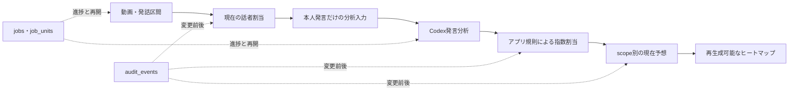

# M1 中核データモデルと処理状態 設計

## 状態

- ユーザー承認日: 2026-08-14 JST
- 対象: M1の最初のサブプロジェクト
- 次のゲート: この文書のユーザーレビュー後に詳細実装計画を作る

## 目的

YouTube動画の取得、分割文字起こし、話者割当、本人発言抽出、Codex分析、対象指数への自動割当、現在予想、ヒートマップを、修正・再分析・途中再開・削除が可能な形でSQLiteへ保存する。

次を同時に満たす。

- 話者処理と予想分析を別データとして扱う。
- 聞き手と保留区間を本人の予想根拠へ混ぜない。
- 日付指定分析の入力と結果を再現可能にする。
- 同じ基準日の再分析は現在値を更新し、変更前後を監査する。
- 異なる基準日の分析結果は共存させる。
- 長時間CPU処理を5～10分単位で再開する。
- 本文データを期限後に削除しても、予想と監査情報を保持する。
- Web検索、現在相場、一般知識、shell、外部ツールをCodex分析へ混ぜない。

## スコープ外

この設計では、次の実装詳細を確定しない。

- YouTube検索クエリと網羅性評価の具体的アルゴリズム。
- 採用する文字起こしエンジンと話者特徴モデルの最終製品選定。
- Codex prompt全文とJSON Schema全文。
- ヒートマップの最終的な色、余白、タイポグラフィ。
- Windows常駐プロセスのインストーラー。
- 実価格を使う予想成績評価。

これらは独立した後続specで扱う。

## 採用方式

### 現在値＋追記専用監査ログ

話者割当、同一分析scopeの正規化済み発言、指数割当、現在予想は、通常テーブルへ現在値を1件だけ保存する。修正時は、変更前JSON、変更後JSON、理由、操作者、日時を `audit_events` へ追記する。

話者割当の修正では、旧分析を自動的に新結果へ置き換えない。依存する分析scopeを `stale` にし、旧結果を警告付きで表示する。再分析が検証まで成功した場合だけ現在値を更新する。

ドメインテーブルの全行を版ごとに複製する方式と、動画全体の完全スナップショットを修正ごとに複製する方式は採用しない。現在検索を単純にし、全文文字起こしの重複も避けるためである。

### 変更不能なrun入力

実行中のCodex分析へ後から発言を追加しない。`analysis_run_segments` と `analysis_input_snapshots` をrun開始前に固定し、SHA-256を保存する。入力本文は保持期限後に削除できるが、hash、区間ID、出典、run設定、分析結果は残す。

## 責務境界

各境界の規則は次のとおり。

1. 動画・発話区間には予想方向を保存しない。
2. 話者割当には市場見通しを保存しない。
3. Codex入力の根拠区間は対象者割当だけに限定する。
4. Codexの指数候補と自己信頼度は提案として保存し、最終信頼度はアプリ規則で検査する。
5. ヒートマップは正本ではなく、現在予想から再生成できるキャッシュとする。

## 日付と時間

### 分析に使う日時

分析用の動画日時はYouTube公開日時 `published_at` だけとする。

- 通常動画はYouTubeメタデータの公開日時を使う。
- ライブ配信はYouTubeが公開する実際の配信開始日時を `published_at` として使う。
- 収録日時は保存せず、Codexやアプリに推測させない。
- システム内部の `created_at`、`updated_at`、job実行日時は障害調査にだけ使い、分析対象、相対期間、ヒートマップを変化させない。

### 日付指定分析

ユーザーが選択した日のJST 23:59:59を `cutoff_at_jst` とする。`published_at` がcutoff以前の動画だけを入力候補にする。システムが取得済みでも、公開日時がcutoffより後なら含めない。

### 相対期間

「今週」「来週」「来月」「半年後」などは `published_at` のJST日付から絶対日付範囲へ正規化する。

- 本人が具体的な年月・日付を述べた場合は明示期間を優先する。
- 正規化結果へ `time_basis = published_at` と実際に使った公開日時を保存する。
- UIは「公開日基準」と絶対日付範囲を表示する。
- ユーザーが期間を修正した場合は、変更前後と理由を監査する。
- 防御可能な期間へ変換できない表現は `unknown_period` とし、主ヒートマップへ入れない。

時刻はDB内でUTCのISO 8601文字列として保存し、JSTへ変換して表示・日付範囲計算する。期間の開始日・終了日はJST暦日の `YYYY-MM-DD` とする。

## 論理エンティティ

実装はSQLiteを使い、ローカル単独利用のため内部主キーは `INTEGER PRIMARY KEY` とする。YouTube動画IDなど外部識別子には一意制約を付ける。

### 出典と文字起こし

#### `analysis_subjects`

- 分析主体の正規名、種別（個人・組織）、有効状態を保存する。
- 検索別名は子テーブル `subject_aliases` に保存する。
- 暁投資顧問は1つの組織主体とする。

#### `videos`

- `youtube_video_id`、タイトル、チャンネル、`published_at`、動画時間、ライブ区分を保存する。
- `youtube_video_id` は一意とする。
- 同じ発言を含む切り抜き・再投稿は別動画として保存し、`duplicate_group_id` で分析上の二重計上を防ぐ。
- `recorded_at` と分析用の取得日は持たない。

#### `transcription_chunks`

- 動画を5～10分の作業単位に分け、開始・終了ミリ秒、入力hash、処理状態、出力hashを保存する。
- 同じ動画内のchunk番号と時刻範囲を一意にする。

#### `transcript_segments`

- 動画、chunk、連番、開始・終了ミリ秒、本文、本文SHA-256、匿名話者IDを保存する。
- `start_ms < end_ms` を必須とする。
- 本文に `transcript_created_at`、`expires_at`、`text_deleted_at` を持たせる。
- 本文削除後は本文をNULLにするが、hash、時刻、出典、区間IDは残す。

#### `voice_reference_profiles`

- 対象者、参照声のモデル・adapter版、特徴ファイルのhash、作成日時、有効状態を保存する。
- 実際の音声、埋め込み、特徴量はリポジトリ外の非公開領域に置く。

#### `speaker_assignments`

- 発話区間ごとに現在の割当を1件だけ保存する。
- `assignment_kind` は `subject`、`interviewer`、`hold` のいずれかとする。
- `subject` の場合だけ `assigned_subject_id` を必須にする。
- 参照声との生の照合値、話者処理engine・model版、自動・手動、修正理由を保存する。
- 単純な2群クラスタリング結果だけで `subject` にしない。

### 分析scopeとrun

#### `analysis_scopes`

- `subject_id` と `cutoff_at_jst` の組を一意にする。
- 異なるcutoffの結果は別scopeとして共存する。
- `status` は `ready`、`running`、`current`、`stale`、`failed` を使う。

#### `analysis_runs`

- 同じscopeの初回実行、再試行、再分析を追記する実行記録である。
- modelは `gpt-5.6-sol`、reasoning effortは `max` を必須にする。
- prompt版、JSON Schema版、入力hash、開始・終了日時、run状態、外部ツール呼び出し件数、安全なerror codeを保存する。
- 下位モデルでの成功扱いを禁止する。
- 外部ツール呼び出し件数が0以外なら採用失敗とする。

#### `analysis_run_segments`

- runへ渡した発話区間と順序を固定する。
- 対応する `speaker_assignments.assignment_kind` が `subject` で、scopeの主体と一致する区間だけを許可する。
- run開始時の `assignment_kind`、`assigned_subject_id`、話者割当更新日時、割当証拠hashも保存し、後から現在の話者割当が修正されても、そのrunが採用した状態を復元できるようにする。
- 聞き手と保留区間が1件でも含まれたrunは採用しない。

#### `analysis_input_snapshots`

- Codexへ渡した正確な本文、メタデータJSON、入力SHA-256をrunごとに1件保存する。
- 作成後は本文削除以外で更新しない。
- `snapshot_created_at`、`expires_at`、`text_deleted_at` を持つ。
- 本文削除後もhash、run、区間IDとの関係を残す。

### 現在の発言分析

#### `current_statements`

- scopeに対する現在有効な正規化済み発言分析を保存する。
- 同じscopeの再分析成功時は、検証済みの新しい集合へ1トランザクションで置換する。
- `source_run_id`、元動画・区間・時刻、短い根拠、元対象表現を保存する。
- `statement_type` は `future_forecast`、`current_analysis`、`general_statement`。
- `condition_kind` は `unconditional`、`conditional`。条件付きでは条件文を必須にする。
- `direction_kind` は `strong_up`、`up`、`flat`、`down`、`strong_down`、`turning_point`、`unknown`。
- 転換点は `bottom`、`top`、`other` の補助区分を持てる。
- 関連発言なしはレコードを作らず、`unknown` と区別する。
- 期間は元表現、正規化開始日・終了日、`time_basis`、期間不明フラグを保存する。

短い根拠は分類を監査できる最小の連続部分とし、既定上限を300 Unicode code pointとする。全文文字起こしの代替表示にはしない。

### 対象指数の自動割当

#### `current_asset_mappings`

- 現在の発言分析から対象資産への割当を1資産1行で保存する。
- 1つの「日本株」発言から日経平均とTOPIXの2行を作成できる。
- 元対象表現、対象資産、`mapping_kind = direct | inferred`、変換理由、Codex自己信頼度、アプリ規則信頼度、最終信頼度を保存する。
- アプリ規則の証拠として、本人内の直接言及、周辺本人発言、競合市場、聞き手だけに存在する手掛かりを、検証済みJSONで保存する。

#### 信頼度規則

最終値は `high`、`medium`、`low`、`unresolved` とする。

- `high`: 本人が指数を直接言及した場合、または本人が「日本株」「米国株」のように対象市場を明示し、規定の変換先以外の競合市場がない場合。
- `medium`: 元表現は「株式市場」など一般的だが、周辺の本人発言が同じ対象市場を一貫して示し、競合市場を実質的に排除できる場合。
- `low`: 候補はあるが本人発言の手掛かりが弱い、または競合市場の可能性が残る場合。
- `unresolved`: 本人発言から対象を決められない、本人発言が矛盾する、または聞き手発言にしか手掛かりがない場合。

Codex自己信頼度だけで昇格させない。アプリ規則信頼度とCodex自己信頼度が異なる場合は、より低い側を自動採用上限とし、不一致フラグを保存する。聞き手発言だけを根拠に `high` または `medium` にしない。

#### `mapping_reviews`

- `low` と `unresolved` に対する `approve`、`correct`、`reject` を追記する。
- 操作者、理由、変更前対象、変更後対象、日時を必須にする。
- 計算された信頼度は書き換えず、レビュー結果と実効的なヒートマップ採用可否を別に保存する。

### 現在予想と表示

#### `current_forecasts`

- scope、資産、期間、条件layerの現在結果を保存する。
- 同じ組に複数の根拠がある場合でも、相反方向を平均してflatにしない。
- 現在見解、信頼度、根拠数、`stale`、`heatmap_eligible`、除外理由を保存する。
- `low`、`unresolved`、期間不明、将来予想以外は、規則またはレビューを満たすまで主ヒートマップへ入れない。
- 条件付き予想は別layerとし、条件付き印と条件文を必須にする。

#### `forecast_statement_links`

- 現在予想と根拠となる `current_statements` を多対多で結ぶ。
- 証拠ドロワーはこの関係から短い根拠、動画、タイムコード、直接・推定、条件、公開日基準を表示する。

#### `heatmap_cells`

- 週・月表示用の再生成可能なキャッシュである。
- scope、主体、資産、期間、layerごとに一意とする。
- 正本は `current_forecasts` とし、cache削除後に再構築できることを必須にする。

### job、checkpoint、監査

#### `jobs`

- 動画pipelineまたは分析scopeの実行を管理する。
- 状態は `queued`、`running`、`pause_requested`、`paused`、`cancel_requested`、`stopped`、`retrying`、`failed`、`succeeded`。
- 実行前に決定的なmanifest hashと総unit数を保存する。

#### `job_units`

- 音声取得、文字起こし各chunk、話者割当、本人発言抽出、Codex batch、自動割当、ヒートマップ更新の実作業単位を保存する。
- 入力hash、出力hash、状態、試行回数、安全なerror code、開始・終了日時を持つ。
- 出力の検証とunit成功状態を同じDBトランザクションで確定する。
- 再開時は入力hashと出力hashが一致する成功unitだけを再利用する。

#### `audit_events`

- 追記専用とする。
- entity type、entity IDまたはscope ID、操作、操作者種別、理由code・理由文、変更前JSON、変更後JSON、日時を保存する。
- 全文文字起こし、正確なCodex入力本文、音声、埋め込みをJSONへ複製しない。
- 本文フィールドはhash、区間ID、短い根拠だけを記録し、365日削除を迂回しない。

## 更新と状態遷移

### 話者割当の修正

1. 現在の `speaker_assignments` を更新する。
2. 変更前後JSONと理由を `audit_events` へ追記する。
3. その区間を入力に使った `analysis_scopes` を `stale` にする。
4. 旧現在予想とヒートマップは警告付きで表示し、古いことを隠さない。
5. ユーザーが再分析を開始するまで自動置換しない。
6. 再分析の全検証が成功した場合だけ現在の発言分析、指数割当、予想、ヒートマップを1トランザクションで更新する。

### 同じscopeの再分析

新しい `analysis_run` を追記し、入力を固定して分析する。検証済み結果を一時領域へ作成し、現在集合の変更前JSONを監査してから置換する。失敗時は現在集合を変更しない。

異なるcutoffのscopeは更新しない。

### 一時停止

`pause_requested` 後、実行中unitを安全境界まで処理し、出力を確定して `paused` にする。再開時は未完了unitから続ける。

### 停止

`cancel_requested` 後、安全境界で `stopped` にする。自動再開しない。再実行時は後継jobを作り、hashが一致する成功済み成果だけを再利用する。

### 失敗と再試行

失敗したunitとjobを `failed` にし、現在予想を部分更新しない。原因解消後は失敗unitから再試行し、成功済みunitを再計算しない。

### review required

話者 `hold`、指数割当 `low`・`unresolved`、期間不明はjob失敗ではない。jobを正常終了できるが、該当結果はレビュー待ちとし、主ヒートマップへ自動採用しない。

## 進捗表示

段階ごとに `完了unit数 / manifest総unit数` を表示する。

- 動画取得
- 分割文字起こし
- 話者割当
- 本人発言抽出
- Codex分析
- 指数自動割当
- ヒートマップ更新

擬似的に増える進捗、処理時間による重み付け、残り時間予測は使わない。現在のstage、unit、処理数、経過時間、最終イベントを表示する。

## Codex分析のfail-closed条件

次の場合はrunを採用せず、現在予想を更新しない。

- `gpt-5.6-sol` またはreasoning effort `max` を使えない。
- 外部ツール呼び出し件数が0ではない。
- JSON Schema違反がある。
- 入力に聞き手または保留区間が含まれる。
- 出力が入力にない動画ID・区間IDを参照する。
- cutoff後に公開された動画を参照する。
- アプリDBへのtransactional保存に失敗する。

エラー詳細へ発言本文、認証情報、prompt入力を出力しない。

## 保持と削除

### 音声

文字起こしと必要な話者照合の完了・検証後に削除する。削除失敗はjobへ記録し、清掃jobで再試行する。

### 全文文字起こしと分析入力

- 既定保持期間は作成日時から365日。
- 設定値は30、90、180、365日、無期限を提供する。
- 閲覧や再分析で期限を自動延長しない。
- ユーザーは期限前でも手動削除できる。
- 削除前に対象動画数、本文件数、削除後に完全再現できないことを表示して確認する。
- 削除後もhash、区間ID、動画・タイムコード、分析結果、短い根拠、model・prompt版、tool count、監査・削除日時を保持する。
- 必要な場合は元動画から再文字起こしし、新しいrunとして分析する。

本文削除で現在予想をcascade deleteしない。削除後は `source_text_deleted` を表示する。

## トランザクション境界

次を原子的に実行する。

- unit出力保存とunit成功化。
- 話者割当変更と監査event追加と依存scopeのstale化。
- 同一scopeの現在発言、指数割当、現在予想の置換と監査event追加。
- mapping reviewの追加と実効的な採用可否更新。
- 現在予想更新と影響heatmap cellの再生成。

途中失敗では現在値を半端に更新しない。

## 受け入れ試験

### 話者と入力境界

1. 722区間を対象者653、聞き手55、保留14に割り当て、合計が722である。
2. Codex入力の根拠区間が対象者653件だけである。
3. 聞き手55件または保留14件が入力に混じるrunを拒否する。
4. 単純2群クラスタリング結果だけで本人確定しない。

### 予想分類と指数割当

5. 「株式市場が底入れする可能性」を上昇へ変えず、転換点として保存する。
6. 本人の日本株文脈から日経平均とTOPIXへ推定割当し、元表現、理由、証拠を保持する。
7. 本人の米国株見通しをS&P 500へ推定割当する。
8. XAU/USDの関連発言がなければ `unknown` を作らず空欄にする。
9. 聞き手発言にしか対象市場の手掛かりがない場合は `unresolved` とする。
10. `low` と `unresolved` はレビューなしで `heatmap_eligible` になれない。
11. ユーザーの承認・修正・却下と理由が監査される。
12. 条件付き予想は別layerで、条件文なしに保存できない。

### 日付指定分析

13. 公開日時がcutoff後の動画は、取得済みでも入力に含まれない。
14. 「来週」を公開日基準で絶対日付範囲へ変換し、`time_basis = published_at` を保存する。
15. 収録日時を要求・推測しない。
16. 内部 `created_at` を変更しても分析結果が変わらない。
17. 異なるcutoffのscopeが共存し、一方の再分析で他方を更新しない。

### 修正、再分析、監査

18. 話者割当修正で変更前後JSONを記録し、依存scopeを `stale` にする。
19. 再分析失敗では旧現在予想を変更しない。
20. 再分析成功時だけ同一scopeの現在値を置換し、変更前後を監査する。
21. 監査JSONへ全文文字起こしまたは正確なCodex入力本文を複製しない。

### checkpointと回復

22. 8つの文字起こしchunk中4つ完了後に停止した場合、hash検証後に5番目から再開する。
23. unit出力保存後・成功化前の障害で、不完全出力を成功扱いしない。
24. 一時停止は同じjobを再開し、停止後の再実行は後継jobを作る。
25. `review required` をjob失敗と誤分類しない。

### Codex境界と削除

26. 外部ツール呼び出し0件のrunだけを採用する。
27. 外部ツール呼び出し1件、Schema違反、架空の区間ID参照で現在予想を更新しない。
28. 365日後の本文削除で、hash、分析結果、短い根拠、削除監査が残る。
29. 音声削除失敗を記録し、清掃jobで再試行できる。
30. 現在予想からheatmap cacheを再構築できる。

## テストの層

- DB制約テスト: 一意性、外部キー、状態enum、時刻範囲、現在値1件、レビューゲート。
- ドメイン規則テスト: cutoff、相対期間、話者隔離、転換点、信頼度、競合市場、空欄。
- pipeline統合テスト: checkpoint、停止・再開、失敗再試行、stale化、transaction、削除。
- 合成end-to-endテスト: 架空名と合成発言だけで、保存済み入力から16行ヒートマップまで検証する。
- 手動性能確認: ユーザー報告の文字起こし約74分、話者割当約4分、Codex分析約4.5分を比較値にするが、固定SLAにはしない。

実音声、実全文文字起こし、実話者特徴はリポジトリのテストfixtureへ含めない。

## 実装順序への制約

詳細実装計画は次の順序を守る。

1. enum、時刻、ID、hashの共通型。
2. SQLite schemaとmigration。
3. repository層とtransactional更新。
4. audit、retention、job state machine。
5. 話者割当からstale化までのドメインservice。
6. analysis scope、run、input snapshot。
7. Codex出力の正規化とfail-closed検証。
8. 指数割当規則とreview gate。
9. current forecastとheatmap cache。
10. FastAPI境界と合成end-to-endテスト。

UI、音声engine、Codex CLI adapterはこの中核境界へ依存し、中核DBがそれらの実装詳細へ依存しない構成にする。
