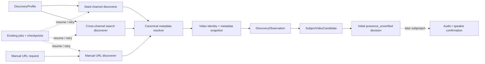

# 実YouTube収集・正規metadata保存 設計

## 状態

- 設計区分: architectural
- 初回ユーザー承認日: 2026-08-18 JST
- 対象: M2中核バックエンド後の最初の実YouTube収集subproject
- 設計レビュー: 会話上の全5節をユーザー承認済み
- 書面レビュー: ユーザー承認済み。commit `9efba8f0e151841b3d10f460fff42dce69269961`へ保存済み
- 実装状態: Task 1～12はcommit済み・独立review済み。Task 13初回reviewの7 Important findingを順次RED/GREEN修正し、完全合成E2Eとarchitecture/smoke境界は17 passed・明示opt-in skip 1件を観測済み
- 検証状態: 全backend 1732件中1730 passed・既存Windows symlink capability skip 1件・real smoke opt-in skip 1件。compileall、work-state All 242 passed・0 failed、state-doc、WorkingTree公開安全206ファイル、diff check、backend wrapperも成功
- 次のゲート: exact 19-path candidateの限定最終review、承認後の限定commit。実YouTube運用受入は明示opt-inがないためpending

## 目的

YouTube Data APIを使って対象者の動画候補を発見し、正規metadata、発見経路、対象者との候補関係を、再開可能かつ監査可能な形でローカルSQLiteへ保存する。

最初の収集subprojectは次を実現する。

- 3つの発見経路を1つの同期処理へ統合する。
  - 基準チャンネルのuploads playlist巡回
  - 対象者名によるYouTube横断検索
  - ユーザーによるYouTube URLの手動登録
- 初回は実行開始時点から直近3暦年をbackfillする。
- 以後は毎日06:00 JSTに自動同期し、設定時刻を変更できる。
- ユーザーは同じ同期処理を「今すぐ同期」として要求できる。
- 発見した候補は `presence_unverified` として保存し、本人出演の確認を後続subprojectへ委ねる。
- API keyをWindows Credential Managerだけに保存し、DB、UI、log、audit、repositoryへ保存・表示しない。

このsubprojectは、動画を発見して正規metadataを保存するところで終了する。音声取得、字幕取得、文字起こし、声紋照合、本人区間の確定、予想分析は実装しない。

## 今回置き換える既存要件

本設計は、M1/M2で確定・実装した次の規則をmaterial revisionとして置き換える。

- 江守哲を固定1チャンネルだけへ限定する規則
- 暁投資顧問をorganization subjectとし、公式チャンネル内の全発話を組織発言として採用する規則
- `subject_channel_policies` による `all_channels` / `fixed_channel` の分析範囲判定
- `subject_video_eligibility` によるチャンネル方針適合判定
- `channel_organization` 話者割当と、それを前提とする分析入力、修正、保持期限、監査規則

最終runtimeでは4人全員を個人主体として扱う。基準チャンネルは動画発見のseedであり、収集範囲または分析範囲を制限するpolicyではない。seed外の動画も、後続の本人出演・本人発言確認に成功すれば分析対象になり得る。

## 対象者とDiscoveryProfile

`subject_aliases` と `discovery_search_terms` は別のデータとする。入力補正用aliasをYouTube検索へ自動転用しない。

| 個人主体 | seed channel IDs | 横断検索語 | 規則 |
|---|---|---|---|
| 木野内栄治 | `UCJ1DVBLVpe4FvBZZ94kreaQ`（マーケット マスターズ、旧公式マーケット・アナライズ） | `木野内栄治` | seed外も本人確認後に採用可能 |
| 大川智宏 | なし | `大川智宏` | 検索・手動登録から同じpipelineへ入れる |
| 江守哲 | `UCVXka7buS_WptsAzSE0LcKg` | `江守哲` | 従来のfixed-only規則を廃止し、seed外も本人確認後に採用可能 |
| 千竈 鉄平 | `UCOfzLmXpI3qmZfV7_Cs1sYA`（暁投資顧問公式） | `千竈鉄平` OR `千竃鉄平` | 公式・外部を問わず、千竈本人の確認済み区間だけを後続分析へ渡す |

次の文字列は既定検索語にもbootstrap aliasにも残さない。

- `木野内英二`: 誤記であり、除外する。
- `大川智ひろ`: 根拠のない表記であり、除外する。
- `暁投資顧問 千竈`、`暁投資顧問 千竃`: seed巡回と重複するため除外する。

千竈の2表記は、暁投資顧問公式site自身が両方を使用しているため、同じDiscoveryProfile内の明示的な検索語として保持する。入力正規化でも異体字aliasが必要なら `subject_aliases`へ別途明示登録するが、一方のtableから他方を生成しない。主体固有のコード分岐にはしない。

## スコープ

### 実装対象

- Windows Credential ManagerからのYouTube Data API key登録、取得、存在確認、削除
- YouTube Data API v3のread-only client
- seed uploads、横断検索、手動URLのdiscoverer
- `videos.list`による正規metadata取得と保存
- append-onlyな発見履歴とmetadata snapshot
- 対象者・動画候補と初期 `presence_unverified` decision
- 既存job/checkpoint機構へ統合した初回backfill、日次incremental sync、手動sync
- Windows Task Schedulerのinstall、update、status、remove
- loopback APIの手動URL登録、同期要求、同期状態取得
- 旧organization/fixed-channel runtimeを完全に除去するschema・bootstrap・service・API・test・docs cutover

### 実装対象外

- 音声・動画ファイルのdownload
- YouTube字幕の取得
- 文字起こしと話者分離
- voice reference登録、本人声判定、speaker assignment作成
- 発見時点での音声jobまたは分析jobの自動生成
- title、descriptionを用いた本人出演の自動確定
- 動画内容の類似判定、元動画・Shorts・切り抜き・再投稿のgrouping
- YouTube収集画面の本格UI
- Credential Manager以外のsecret store
- 複数PC、複数Windowsユーザー、常駐service

## 採用architecture

3つのdiscovererを統合するSync Orchestrator方式を採用する。

4人の差はDiscoveryProfileの設定だけに閉じ込める。対象者別のcollector、if/elif、専用job kind、専用API routeを作らない。

### 責務境界

| unit | 責務 | 依存してよいもの |
|---|---|---|
| `credentials/windows.py` | Credential Managerのread/write/delete/status | Win32 credential APIだけ |
| `youtube/client.py` | HTTP request、quota分類、provider errorの安全な変換 | credential provider、注入されたtransport |
| `youtube/discovery.py` | seed/search/manualの候補ID列挙 | YouTube client、純粋なURL parser |
| `youtube/metadata.py` | `videos.list`結果の厳密な正規化とhash生成 | domain value objectsだけ |
| `repositories/discovery.py` | profile、snapshot、observation、candidate、presence、checkpointの永続化 | caller-owned SQLite transaction |
| `services/youtube_sync.py` | 全profile・discovererの編成、job/checkpoint、retry、cursor | repository、YouTube client interfaces |
| `workers/scheduled_sync.py` | `--once` worker entry point | sync service、credential provider |
| Windows Task Scheduler adapter | task install/update/status/remove/on-demand start | Windows Task Schedulerだけ |
| loopback API routes | strict request/response、durable request、task start | application servicesだけ |

network、Windows API、DBを同じmoduleへ混在させない。service testはfake transport、fake credential provider、fake schedulerを注入できなければならない。

## Legacy cutoverとDB reset

過去migration SQLはM2の履歴として残し、書き換えない。新しいcutover migrationを0017より後へ追加する。

### 起動時判定

- DBファイルがfreshで、起動時点にmigration ledgerが存在しない場合は、過去migrationとcutover migrationを同じmigration runで適用できる。
- 起動開始時点ですでにpre-cutover migration履歴があり、cutover migrationだけが未適用の場合は、内容量にかかわらず `COLLECTION_MODEL_RESET_REQUIRED` で停止する。
- 判定はstartup/migration boundaryだけに置く。通常runtimeへlegacy/new分岐を残さない。
- エラー発生時はmigrationを適用せず、ledgerも進めず、DBファイルを削除・移動・変更しない。
- 利用者が既存DBを任意の場所へ明示的に退避し、空DBで再起動する。アプリは自動削除・自動rename・自動変換を行わない。

この規則により、既存履歴を不完全にperson subjectへ変換する経路を作らず、新しいDBだけを単一の正規runtimeへ載せる。

### cutover後の完成schema

cutover migrationは、同じfresh migration chainで作られ、ユーザーデータを持たないhistorical schemaを前提に、依存table・foreign key・triggerをtopological orderで再構成する。過去migrationが作る内部reference rowsは、完成schemaに必要なものだけを決定的に再seedする。完成schemaには次を残さない。

- `subject_channel_policies`
- `subject_video_eligibility`
- organization専用table、column、trigger、CHECK値
- `fixed_channel`、`all_channels`、`channel_organization`をruntime意味として扱う制約
- 旧policy ID/hashまたはeligibility IDへ依存するjob bindingとanalysis input binding

Python側からも次を同じcutoverで削除する。

- `SubjectKind.ORGANIZATION`
- `PolicyKind`
- `AssignmentOrigin.CHANNEL_ORGANIZATION`
- organization assignment service path
- fixed-channel correctionとeligibility reevaluation path
- 旧route、bootstrap、repository、domain value object、test fixture

final-schema testとarchitecture testで、旧table・trigger・symbol・import pathが存在しないことを証明する。legacy compatibility layerは作らない。

## 論理データモデル

### `analysis_subjects`

4人の個人主体を保存する。organization/fixed-channel分岐に使うsubject kindを完成schemaへ残さない。入力補正用aliasは `subject_aliases` に保持できるが、検索語とは結合しない。

### `discovery_profiles`

主体ごとの安定identityを1件保存し、active状態とcurrent version pointerを持つ。収集設定はappend-onlyな `discovery_profile_versions`へ保存し、version ID、canonical config hash、作成日時を持つ。seedと検索語はversionへ属する子tableへ正規化する。

- `discovery_seed_channels`: profile versionごとに0件以上の正規YouTube channel IDを保持する。
- `discovery_search_terms`: profile versionごとに1件以上の明示的な検索語とordinalを保持する。

設定変更は共通serviceで新versionを追記してcurrent pointerを移し、変更前後をsafe auditへ記録する。過去versionをUPDATE/DELETEしない。発見設定の変更は既存分析結果を自動的に書き換えず、次回同期以後の発見範囲だけを変える。

### `videos`

正規のYouTube video IDを安定identityとして1行だけ保存する。`youtube_video_id`を一意とし、現在のmetadata snapshotを指すservice-owned pointerを持つ。

異なるvideo IDは、内容が同じでも別video rowとする。元動画、Shorts、切り抜き、再投稿を内容hashで統合しない。

### `video_metadata_snapshots`

`videos.list`から正規化した次の値をappend-onlyで保存する。

- video ID
- channel IDと表示名
- titleとdescription
- 分析用 `published_at`
- duration
- live状態
- 取得日時、schema version、canonical content hash

live動画で `actualStartTime` が取得できる場合はそれを分析用 `published_at` とし、それ以外は正規の `snippet.publishedAt` を使う。canonical content hashはschema versionと正規化済みprovider fieldsだけから計算し、取得日時を含めない。同じvideoのcurrent snapshotとcanonical content hashが同じ場合は新しいsnapshotを増やさず、既存snapshotを再利用する。異なる場合だけsnapshotを追記し、同じtransaction内でcurrent pointerを移す。snapshot自体はUPDATE/DELETEしない。

raw provider responseは保存しない。

### `discovery_observations`

動画をどの経路で発見したかをappend-onlyで保存する。

- sync job ID
- DiscoveryProfile ID
- video ID
- 使用したmetadata snapshot ID/hash
- source kind: `seed_uploads`、`cross_channel_search`、`manual_url`
- safe source key: seed channel ID、検索語set hash、manual request ID
- observed_at
- idempotency key

同じ同期job、profile、discoverer、source key、video IDの再実行は同じobservationへ収束する。別jobでの再発見、別discovererでの発見、別subjectからの発見は別observationとして追記できる。元の手動URL、API request URL、page token、provider payloadはobservationへ保存しない。

### `subject_video_candidates`

DiscoveryProfileとvideoの組を安定identityとして1行保存する。同じ動画が複数人の候補なら、video rowは1件のまま、candidateは人物ごとに別行となる。

candidate初回作成時だけ、最初のobservationと初期presence decisionを同じtransactionで作る。再発見はcandidateまたはpresenceをresetしない。

### `presence_decisions`

candidateに対する出演判定をappend-onlyで保存する。このmodelで許可するstateは次の3つとする。

- `presence_unverified`: 収集済みだが本人出演を未確認
- `presence_confirmed`: 後続subprojectで本人出演を確認
- `presence_rejected`: 後続subprojectで本人出演なしと判定

各decisionはcandidate ID、state、decision origin、evidence reference/hash、作成日時、canonical decision hashを持つ。初期 `presence_unverified`はoriginを `collection_initial`とし、最初のdiscovery observation ID/hashへbindする。後続のconfirmed/rejected decisionは、後続subprojectが定義するverifier evidenceへbindしなければならない。

candidateはcurrent decisionを指すservice-owned pointerを持つ。pointerは同じcandidateのdecisionだけを指せる。collection subprojectが作れるのは初期 `presence_unverified` だけである。後続subprojectは新decisionを追記してpointerを移すが、discovery observationやsync cursorを変更しない。

このsubprojectは `presence_confirmed` / `presence_rejected` を作るpublic APIまたは運用CLIを提供しない。既存analysis backendの回帰testは、test layerの共通synthetic fixtureでschema-validな確認済みdecisionとspeaker assignmentを準備する。test用の抜け道をproduction routeへ公開しない。

### 後続pipelineとのbinding

後続のvideo/audio jobは、旧 `subject_video_eligibility` ではなく `subject_video_candidate`へbindする。collection段階ではaudio jobを作らない。

analysis inputへ進めるには、次をすべて必要とする。

1. candidateのcurrent decisionが `presence_confirmed`
2. transcript segmentのcurrent speaker assignmentが同じperson subjectを指す
3. cutoff日時以前の正規metadata snapshotが選択される

run input snapshotは、旧policy ID/hashの代わりに、metadata snapshot ID/hash、presence decision ID/hash、speaker assignment evidenceを固定する。確認された動画内でも、本人以外の発話を分析へ入れない。

## Discovery規則

### Seed channel discovery

1. `channels.list`でchannelのuploads playlist IDを解決する。
2. `playlistItems.list`で対象期間の動画IDを列挙する。
3. 動画IDを最大50件ずつ `videos.list`へ渡す。

seed channelでは、対象期間内の全uploadsを候補として列挙する。titleまたはdescriptionに本人名がないことを除外条件にしない。文字列一致は後続処理のpriority hintに使えても、candidate作成を妨げてはならない。

### Cross-channel search discovery

profileごとに1つの論理queryを使う。千竈 鉄平だけは、設定された2語をYouTube Data APIのOR構文で同じqueryにする。

- `type=video`
- `order=date`
- `maxResults=50`
- 固定した `publishedAfter` / `publishedBefore`
- `pageToken`によるpagination

run開始時に検索上限時刻を固定し、途中で移動させない。初回backfillの下限は、固定JSTで見たrun開始日から3暦年前の同日開始とし、UTC instantへ変換する。

1つの時間windowで10 pageを取得しても `nextPageToken` が残る場合は、そのwindowを時間で二分してchild work itemsとして続行する。API境界が両端を含み得るため、分割境界は重複取得を許し、同一jobのidempotency keyで重複observationを吸収する。partial parent windowを完了扱いせず、全child window完了後にだけ親を完了させる。

1日より細かく分割しない。最小windowが10 pageを超える場合はpaginationをcheckpointし、quota上限に達したら翌日の同じjobで続行する。page tokenが無効または失効した場合は、同じ固定windowの先頭から再実行し、idempotency keyで収束させる。

### Manual URL discovery

loopback APIはsubject IDとURLを受け取り、厳格なhost/path parserでvideo IDを抽出する。初期版で受理するURLは次の形式に限定する。

- `https://youtube.com/watch?v=<video-id>`、`https://www.youtube.com/watch?v=<video-id>`、`https://m.youtube.com/watch?v=<video-id>`
- `https://youtu.be/<video-id>`
- 上記3つの `youtube.com` hostに対する `/shorts/<video-id>`
- 上記3つの `youtube.com` hostに対する `/live/<video-id>`

host spoofing、userinfo、fragment由来ID、複数の競合ID、正規長・文字集合に合わないIDを拒否する。DBへ保存するのは抽出したvideo IDだけで、入力URLやtracking queryを保存しない。

manual URLも `videos.list`で正規metadataを取得し、seed/searchと同じsnapshot、observation、candidate、presence規則を通る。入力URLのchannel表示や文字列を正本にしない。

3年windowは自動seed/search discoveryの初回範囲であり、ユーザーが明示したmanual URLの公開日時を制限しない。3年より古い動画でも正規metadataが取得できれば同じcandidate pipelineへ入れる。

### Canonical metadata transaction

1 batchのmetadata正規化、video identity、snapshot、observation、初回candidate、初回presence decisionはcaller-owned transactionで一括保存する。schema不一致、invalid datetime、invalid boolean、ID不整合、batch内重複矛盾が1件でもあればbatch全体をrollbackする。

`videos.list`に指定IDが返らない場合は、safeなunavailable resultをjob attemptへ記録するが、正規metadataのないvideo、observation、candidateを作らない。

## Sync Orchestratorとcheckpoint

`YOUTUBE_SYNC`を既存job/checkpoint機構へ追加する。別の汎用job state machineを作らない。

既存M2のsealed manifestとexact `total_units`を維持する。full-discovery jobのjob unitsは、run開始時にprofile×discoverer単位で固定する。seedがないprofileにはseed unitを作らず、各profileにsearch unitを1件作る。manual-only jobはmanual request 1件に対して固定unit 1件とする。

adaptive search window、page token、metadata batchは、固定search unit配下のdomain checkpoint rowsとして保存する。window splitで新しい `job_units`を追加せず、全checkpoint rowsが完了した時だけ親job unitをSUCCESSにする。domain checkpointは作業位置を表すだけで、job status・attempt・successorを独自に持つ第2のjob state machineにはしない。

### 同時実行

- system全体でactiveなYouTube syncは最大1件とする。
- 日次syncと「今すぐ同期」は同じfull-discovery manifestを使う。両者が重なった場合は、後着requestが互換なactiveまたはqueued job IDを受け取り、新しいfull-discovery jobを作らない。
- 手動URL登録は、そのrequest IDだけを固定したmanual-only `YOUTUBE_SYNC` jobを作る。別jobがactiveならqueuedのまま待ち、full-discovery cursorへ影響しない。
- active jobは最大1件だが、ユーザーが明示的に作ったmanual-only jobと、時刻到来で必要になったfull-discovery jobはqueuedになり得る。
- process内lockだけに依存せず、SQLiteの一意制約とtransactionで二重active jobを防ぐ。
- failureを契機に新jobを連鎖生成しない。recover/resumeは同じjobを使う。

### run manifest

同期開始時に次を固定する。

- run upper bound
- initial backfill floorまたはincremental floor
- 対象profile IDs、immutable profile version IDs、config hashes
- discoverer set
- quota contract version
- manual request IDs

profile設定が実行中に変わっても、runはmanifestへbindしたimmutable versionで最後まで続行する。次のjobだけが新しいcurrent versionを使う。bound version ID/hashが欠損または不一致ならstored-manifest corruptionとしてfail closedし、新設定を同じrunへ混ぜない。

quota deferには新しいJobStatusを追加しない。既存の `RETRYING` と、sync checkpointのcanonical `resume_not_before_utc`を使う。Task Scheduler workerは時刻到来前のjobをclaimせず、次の利用可能なjobへ進む。永続的な入力不備はsafe FAILEDとして残し、利用者が原因を直した後の明示syncまたは次回scheduled syncが同じresumable jobを再開する。

### cursor

- full-discovery jobだけがbackfill/incremental cursorを所有する。manual-only jobはglobal cursorを読み書きしない。
- durable cursorはprofile IDとsafe source keyの組で保持する。seedはchannel ID、searchはordered term-set hashをsource keyとする。
- source keyに完了cursorがなければ、そのsourceだけを固定upper boundから3暦年前までbackfillする。既存source keyは直前に完全成功したupper boundから次の固定upper boundまでを処理する。
- profile version変更で同じsource keyが残ればcursorを再利用する。新seedまたは新しいsearch term setは新source keyとなり、3年backfillから始める。
- pageまたはbatchをcommitしてから、そのcheckpointを同じtransactionで進める。
- 各unitの次cursorはjob内のproposed valueとして保持する。1 profileまたは1discovererでも未完了なら、どのdurable source cursorも進めない。全固定job unitsのSUCCESSと同じfinal transactionでcursor mapを一括promoteする。
- quota defer、network failure、process crash後は、最後にcommit済みのwork itemから同じjobを再開する。

## Scheduler

Windows Task Schedulerをhostとし、長寿命workerを置かない。

- taskは現在のWindowsユーザーに1件だけ登録する。
- principalは同じユーザーのinteractive tokenとし、Windows passwordをtaskへ保存せず、「ユーザーがログオンしている時だけ実行」を採用する。ログオフ中の予定時刻は次回利用可能なログオン状態でcatch upする。
- defaultは毎日06:00 JSTとする。
- `StartBoundary`へUTC offset `+09:00`を含む値を設定する。
- `StartWhenAvailable=true` とし、PC停止中の06:00を次回利用可能時にcatch upする。
- multiple-instance policyは `Queue` とし、同時実行せず、active task中に届いたmanual-only jobの起動要求を後続instanceへ送る。
- task actionは、repositoryの安全なentry pointを明示引数で `youtube-sync worker --once` として起動する。
- `shell=False`相当の引数配列を使い、API keyをargumentまたはenvironmentへ入れない。
- manual syncは新しい実行方式を作らず、同じtaskのon-demand startを要求する。

ここで `--once` は「task processを1回起動する」という意味である。processはSQLite上のrunnable jobを1件ずつclaimし、同時実行せず、開始時または実行中にすでにqueuedだったjobをquota・defer境界まで順番にdrainしてから終了する。Task Scheduler側で複数のon-demand requestが1件へ集約されても、durable DB queueを取りこぼさない。

Task Schedulerをschedule設定の唯一の正本とする。DBへ同じ時刻を二重保存しない。

初期subprojectではschedule管理をCLIに限定する。

- `youtube schedule install --time 06:00`
- `youtube schedule update --time HH:mm`
- `youtube schedule status`
- `youtube schedule remove`

## Credential境界

YouTube Data API keyはWindows Credential Managerだけに保存する。

- credential target nameはアプリ固定値とする。
- 登録はCLIの非表示promptからだけ行う。
- command-line argument、environment variable、config file、DB、HTTP API、UIからkeyを受け取らない。
- `status`は設定済みかどうかだけを返し、key本体、prefix、suffix、長さ、hashを表示しない。
- workerは実行時に同じWindowsユーザーのcredentialを読む。
- credential取得失敗はsafe codeへ変換し、生のWin32 errorやbufferを公開しない。

初期CLIは `youtube credential set`、`youtube credential status`、`youtube credential delete`だけを提供する。keyを読み出して表示するcommandは作らない。

YouTube API keyはHTTP queryへ含まれ得るため、HTTP clientのdebug loggingを無効化し、request URL、prepared request、provider exception本文をそのままlog・audit・APIへ渡さない。

## Loopback API

既存M2と同じく `127.0.0.1`だけへbindするが、loopbackを認証境界とはみなさない。unknown field禁止、厳密型、状態変更はPOSTとする。

### `POST /api/youtube-syncs`

全active DiscoveryProfileの手動syncを要求する。active jobがあれば再利用し、`202 Accepted`でsafeなjob ID、status、reused flagだけを返す。

API request transactionでqueued jobまたは既存jobへのrequestを耐久化した後、Task Scheduler taskをon-demand startする。task起動に失敗した場合は `YOUTUBE_SYNC_UNAVAILABLE`を返す。queued jobは安全に残り、次のmanualまたはscheduled workerが再利用できる。

### `GET /api/youtube-syncs/{job_id}`

job status、profile/work itemの安全な集計、quota defer状態、完了件数だけを返す。search query、page token、provider本文、動画description、credential情報、ローカルpathを返さない。

### `POST /api/youtube-manual-candidates`

strict body `{subject_id, url}` を受け取る。subjectはactive DiscoveryProfileを持つpersonに限定する。URL検証後は抽出video IDとprofile IDだけをdurable requestへ保存し、同じorchestratorへ渡す。

API transactionはmanual requestと、そのrequest IDだけを含むimmutableなmanual-only `YOUTUBE_SYNC` jobを一緒に作り、`202 Accepted`でrequest IDとjob IDを返す。manual requestはprofile IDと抽出video IDの組で一意とする。同じ組がすでにあれば、状態にかかわらず既存request/jobを返し、新しいmanual observationを作らない。別syncがactiveならjobはqueuedとなる。Task Schedulerのon-demand startが失敗してもqueued jobは残り、次のtask起動で処理できる。

同じvideoを複数subjectへ登録できる。同じsubject・videoのHTTP retryと後日の再登録は同じrequest/jobへ収束する。別jobでのseed/search再発見と、別subjectからの手動登録は別observationになる。

## Error handlingとquota

### retry

一時的なnetwork error、quota理由ではないHTTP 429、HTTP 5xxは、初回を含め最大4 attemptsとする。基本waitは1秒、4秒、16秒とする。安全にparseした `Retry-After`が0～60秒なら基本wait以上の値として使い、60秒を超える場合はsleepせずcheckpointしてdeferする。quota理由を示すprovider errorはretryより先にquota deferへ分類する。

### quota

endpoint classごとに消費を分けて数える。

- `search.list`: 現行defaultの独立100 calls/day bucketで、1 requestが1 call
- `channels.list`、`playlistItems.list`、`videos.list`: 現行defaultの合計10,000 units/day bucketで各1 unit

日次の通常検索は、各profileが1 pageで収まる場合、4 profile合計4 search callsである。candidateがなければ追加 `videos.list`を発生させない。初回backfillはadaptive windowとcheckpointで複数日に継続できる。

quota exhaustedまたはproviderがquota errorを返した場合はbusy retryせず、jobをdeferred状態にして次の日次実行で同じcheckpointから再開する。quota仕様値はprovider変更の影響を受けるため、client定数と公式資料linkを一か所へ集約する。

各network attemptは、call前にendpoint bucket、attempted_at、job/work item IDだけをdurable reservationとして記録する。同じUTC日のsearch bucketとread bucketを`BEGIN IMMEDIATE` transaction内でcountしてから予約し、exact limitを許可して次のreservationを拒否する。call前crashで実際には消費しなかったreservationが残ることは許し、provider消費を過少記録する方向へ補正しない。localまたはprovider quota exhaustedのjobは `resume_not_before_utc = observed_at + 24 hours`として `RETRYING`にし、それ以前のmanual startではclaimしない。公式quotaはPacific Timeの午前0時にresetされるため、24時間後の再開は必ず少なくとも1回のprovider resetをまたぐ。

### fail closed

- invalid/missing credential: 即時停止し `YOUTUBE_CREDENTIAL_NOT_CONFIGURED`またはsafe credential code
- invalid manual URL: 422 `INVALID_YOUTUBE_URL`
- unavailable/private/deleted video: safe unavailable result、candidateなし
- invalid JSONまたはschema drift: batch rollback
- invalid page token: 固定window先頭からidempotent再実行
- scheduler unavailable: 503 `YOUTUBE_SYNC_UNAVAILABLE`
- provider本文を含み得る未知例外: 500 `INTERNAL_ERROR`

log・auditにはsafe code、job ID、work item ID、attempt number、endpoint class、件数だけを記録できる。API key、完全request URL、raw response、title、description、手動入力URL、page tokenを記録しない。

## ループと再実行の不変条件

1. DiscoveryObservationの作成は、初回candidateと初回 `presence_unverified` decisionまでしか引き起こさない。
2. collection subprojectはaudio、transcription、speaker、analysis jobを作らない。
3. 後続のpresence decisionまたはspeaker assignmentは、discovery profile、observation、sync cursorを変更しない。
4. retryは同じjob・work item・idempotency keyを使い、新jobを生成しない。
5. scheduled syncと「今すぐ同期」のoverlapは同じcompatible jobへ収束する。手動URLはimmutableなmanual-only queued jobとなり、full-discovery manifestへ途中追加しない。
6. metadata再取得は、内容が同じならsnapshotを増やさず、内容が変わってもcandidate/presenceをresetしない。
7. search window splitはparent completionをchild completionから一方向に集約し、childから新しいparentやsync runを生成しない。

この依存方向により、発見、確認、分析、再発見の間に循環を作らない。

## 実装phase

### Phase A: clean model cutover

- startup reset gate
- cutover migrationとfinal schema
- 4人のperson subjectとDiscoveryProfile bootstrap
- 旧runtime symbol、service、API、test fixtureの削除
- downstream analysis input bindingの新presence/speaker model化

Phase A完了時点で、fake dataを使う既存中核backendが新しい単一路線で通ることを必須とする。

### Phase B: collection core

- credential interfaceとfake
- YouTube clientとfake transport
- seed/search/manual discoverer
- metadata normalizer
- repository、snapshot、observation、candidate、presence

### Phase C: durable orchestrationとAPI

- `YOUTUBE_SYNC` job manifest、work items、checkpoint
- retry、quota、adaptive window、crash recovery
- manual request、sync request、status API

### Phase D: Windows operation

- Credential Manager adapterとCLI
- Task Scheduler adapterとCLI
- `--once` worker
- opt-in real provider smoke procedure

各phaseはstrict test-firstで実装し、独立reviewとfresh full verificationを通してから次へ進む。単一specの中でphaseを分けるが、legacy/new runtimeを並存させる段階は作らない。

## 検証戦略

automated testは実network、実API key、実Credential Manager、実Task Schedulerを必要としない。fake transport、fake credential provider、fake schedulerを使い、requestと副作用を完全に観測できるようにする。

### Schemaとarchitecture

- fresh DBで全migrationが成功する。
- pre-cutover DBは変更なしで `COLLECTION_MODEL_RESET_REQUIRED`になる。
- cutover後に旧table、trigger、column value、Python symbol、import pathが存在しない。
- 4人全員が同じorchestrator factoryから構築される。
- subject nameまたはsubject IDによるproduction分岐がない。
- network、Windows、DB boundaryが別moduleである。

### Profile configuration

- seed IDsと検索語が本書の表と完全一致する。
- 木野内英二、大川智ひろがbootstrap aliasと検索語のどちらにも存在せず、暁投資顧問付き検索語も存在しない。
- `subject_aliases`を変えてもsearch requestが変わらない。
- 千竈の2語だけが1つのOR queryになる。

### Discoveryとmetadata

- seed uploadはtitle/descriptionに氏名がなくてもcandidateになる。
- search結果はすべて初期 `presence_unverified`となる。
- manual URLは全許可形式とhost spoofing/競合IDを検査する。
- 同一video IDは1 video row、別経路は複数observationとなる。
- 異なるvideo IDは内容が同じでも統合されない。
- metadata同一時はsnapshot再利用、変更時は追記とpointer移動になる。
- malformed provider batchは全rollbackする。

### Resumeとquota

- page retry、invalid token、window split境界、batch retryが重複しない。
- process crash前後で、commit済みpageだけが残り、未commit batchは残らない。
- quota exhaustedでcursorを進めず、翌日の同jobから再開する。
- network call前のquota reservation後にcrashしても過少計上せず、provider quota error後24時間は同じjobをclaimしない。
- manual/scheduled同時要求が1 active jobへ収束する。
- active full-discovery中の手動URLがmanual-only queued jobとなり、Task Schedulerの後続instanceで処理される。
- profile version変更中も旧runはbound versionで完了し、次runだけが新versionを使う。

### Securityとpublic safety

- keyがargv、environment、DB、audit、log、exception、API responseに現れない。
- provider URL、raw response、manual URL、page tokenが公開出力へ現れない。
- API request/responseはunknown fieldと型coercionを拒否する。
- Task Scheduler actionにsecretが含まれない。
- repositoryのpublic-safety scannerと`.gitignore`がcredential、DB、log、cacheを拒否する。

### Scheduler

- default 06:00 JST、明示 `+09:00`、`StartWhenAvailable=true`である。
- multiple-instance policyが `Queue`で、taskを同時実行しない。
- scheduled/manualとも同じ `--once` actionを使う。
- install/update/status/removeがidempotentで、管理対象外taskを変更しない。

### E2Eとreal smoke

fake E2Eは4 profile、seed、search、manual、canonical metadata、observation、candidate、presence、resume、API statusまでを通す。

実YouTube smokeは明示的なopt-in commandだけで実行し、Credential Managerへ事前登録したkeyを使う。CI、通常backend suite、design acceptanceの必須条件にはしない。実行してもraw responseやcredentialをreportへ残さない。

credentialを利用できる受入環境では、read-only smokeで `channels.list`、`playlistItems.list`、`search.list`、`videos.list`の各adapterを最小件数だけ確認する。credentialがまだ提供されない場合は実装をcommitできるが、project statusへ「実YouTube operational acceptance pending」と明記し、実API検証済みとは報告しない。

## 完了条件

次をすべて満たした時、このsubprojectを実装完了とする。

1. 空DBからの全migrationとbootstrapが成功する。
2. 既存pre-cutover DBが無変更で停止し、明示reset手順が文書化されている。
3. final schemaとruntimeから旧organization/fixed-channel経路が完全に消えている。
4. 4人のprofileが設定差だけで同じorchestratorを通る。
5. fake E2Eでseed、search、manual、metadata、observation、candidate、`presence_unverified`、checkpoint、resumeが成功する。
6. scheduler、credential、APIの安全境界が自動testで証明される。
7. 全backend回帰、compile、work-state、state-doc、public-safety、diff checkが成功する。
8. 独立reviewで未解決Critical/Important/Minorが0である。
9. 実装報告が、音声取得・本人声確認・分析を未実装の後続subprojectとして明示する。
10. credentialを利用できる場合はopt-in real smokeが成功する。利用できない場合はoperational acceptance pendingを明示する。

## 採用しない方式

- 対象者ごとのcollector/service/job
- seed channelを収集・分析のallowlistとして使う方式
- 旧organization/fixed-channelと新presence modelのdual-readまたはdual-write
- 既存DBを推測でperson subjectへ自動変換する方式
- API request thread内でYouTube paginationを完走する方式
- scheduled syncとmanual syncに別orchestratorを持つ方式
- title/descriptionの氏名不一致によるhard exclusion
- 動画内容の重複排除
- API keyのconfig file、environment、DB、UI、HTTP API経由

## 外部仕様の根拠

- YouTube Data API `search.list`: <https://developers.google.com/youtube/v3/docs/search/list>
- YouTube uploads playlistによる動画取得: <https://developers.google.com/youtube/v3/guides/implementation/videos>
- YouTube Data API `videos.list`: <https://developers.google.com/youtube/v3/docs/videos/list>
- YouTube Data API quota概要: <https://developers.google.com/youtube/v3/getting-started>
- YouTube Data API quota calculatorとreset時刻: <https://developers.google.com/youtube/v3/determine_quota_cost>
- Windows Task Scheduler `StartBoundary`: <https://learn.microsoft.com/en-us/windows/win32/taskschd/trigger-startboundary>
- Windows Task Scheduler settings: <https://learn.microsoft.com/en-us/windows/win32/taskschd/tasksettings>
- Windows Credential Manager `CredReadW`: <https://learn.microsoft.com/ja-jp/windows/win32/api/wincred/nf-wincred-credreadw>
- 暁投資顧問の千竈表記: <https://akatsuki-toushi.com/about/intr/>、<https://akatsuki-toushi.com/course/op100/>

YouTube quota値は2026-06-01更新の公式資料を基準にした。providerが将来変更し得るため、実装時に公式資料とclient定数を再照合する。
