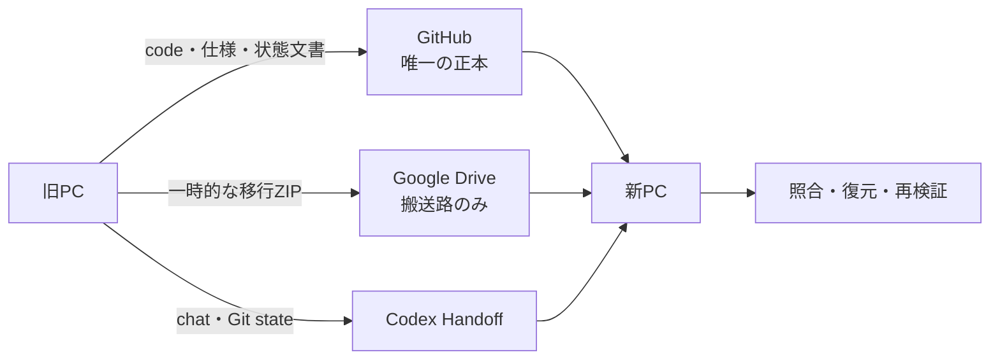

# PC移行とCodex Handoff 設計

## 目的

現在の開発PCから新しいWindows PCへ、GitHubに保存できる開発状態と、GitHubへ保存しないローカルデータを安全に移し、新PCのCodexが中断地点と同等の文脈から作業を再開できるようにする。

利用者の操作は、旧PCでの移行準備指示、CodexのHandoff、新PCでの復元指示の3つに限定する。Google Driveを常用データ置き場や正本にはせず、PC移行中だけ使う一時的な搬送路とする。

## 既存設計との関係

この設計は、`2026-08-14-cross-pc-work-state-design.md` のGitHub保存・再開基盤を置換しない。GitHubに置けない本番DB、音声モデル、固定インストール資材、非公開の補助作業記録を移す経路と、Codexの会話を別ホストへ移す経路を追加する。

次の既存原則を維持する。

- GitHub上のコード、要件、決定、計画、状態文書を開発状態の唯一の正本とする。
- 本番DB、認証情報、音声、全文文字起こし、話者特徴、モデル、キャッシュをGitHubへcommitしない。
- 保存完了はpush後のlive remote SHA一致を条件とする。
- 新PCでの再開時は、状態文書より実Git状態、ソース、DB検査、fresh testを優先する。
- 複数PCから同時にアプリやワーカーを書き込まない。

## 採用方式



3つの経路には次の責務だけを持たせる。

| 経路 | 責務 | 正本性 |
|---|---|---|
| GitHub | コード、テスト、要件、設計判断、現在の進捗、未完了事項、再開手順 | 唯一の正本 |
| Google Drive | GitHubへ置けないデータを1回のPC移行中だけ運ぶ | 正本ではない |
| Codex Handoff | 同じChatGPT account/workspace間で現在のchatとGit stateを移す | 便利な移送手段であり、復旧条件ではない |

Handoffが利用できない、または失敗した場合でも、GitHub checkpointとGoogle Drive bundleだけから意味的に同じ中断地点を再構築できなければならない。

## 利用者フロー

### 旧PC

利用者は、Google Drive Desktopで同期されるローカルフォルダーを指定して、Codexへ次の趣旨を指示する。

> PC移行を準備してください。Google Driveの指定フォルダーへ移行パッケージを保存してください。

Codexは既存の保存契約に従ってGitHub checkpointを完成させた後、旧PCを凍結し、移行bundleを作成・自己検証する。feature branchはそのまま保存し、移行のためだけに`main`へ統合しない。upstream未設定の現在branchには、利用者が承認した既存`origin`上の同名branchを設定し、通常pushとremote SHA確認を行う。

### Codex Handoff

利用者は新PCへCodex、Git、Google Drive Desktop、対応する64-bit Python 3.14をインストールする。Codexへ同じChatGPT account/workspaceでログインし、同じGitHub repositoryをcloneしてCodex projectとして保存する。両PCをConnectionsで接続し、このchatの実行場所メニューから新PCへHandoffする。

HandoffはchatとGit stateの移送に使用するが、Handoffの成功だけを保存完了またはデータ移行完了とは扱わない。

### 新PC

Handoff後のchat、またはHandoffを使えなかった場合の新しいCodex taskへ、次の趣旨を指示する。

> Google Driveの指定ZIPからこのPCへ復元し、GitHubとデータを検証して、作業を中断した地点から再開してください。

CodexはGitHub checkoutを先に検証し、bundleを一時領域で検査してからローカルデータを復元する。実装再開前に、branch、commit、remote照合、DB状態、runtime、資格情報状態、Task Scheduler、fresh test、未完了作業をまとめたpre-work summaryを示す。

## GitHub checkpoint契約

移行bundleを確定する前に、既存の`$save-work-state`契約を満たす。

1. 現在のソース、テスト、Git差分、設計、非公開補助記録を照合する。
2. `requirements.md`、`decisions.md`、`plan.md`、`status.md`へ、現在の完了事項、未完了事項、検証結果、次の作業を反映する。
3. 状態文書検査、公開安全検査、関連product testを実行する。
4. 所有が明確なpathだけをstageし、焦点の合ったcommitを作る。
5. 現在のfeature branchを通常pushし、live remote SHAとlocal `HEAD`の一致を確認する。
6. 作業ツリーをcleanにする。無関係または所有不明の変更が残る場合はbundle作成へ進まない。

product作業が途中であってもcheckpointは作成できる。ただし、未完了条件、失敗中のtest、再開時の最初の作業を`status.md`へ正確に記録する。

## 旧PCの凍結

GitHub checkpoint後、bundle作成前に次を行う。

1. アプリ、presence worker、YouTube workerが実行中でないことを確認する。
2. 実行中または未決済のOS processがあれば、強制終了やDB copyを行わず停止する。
3. 既定06:00の日次Task設定を記録し、旧PCのTaskを無効化または削除して新しい書き込みを止める。再登録可能な操作だけを使い、データは削除しない。
4. `temp-audio`が空で、`local_artifacts`に未削除artifactがなく、DBの`PRAGMA integrity_check`が`ok`であることを確認する。
5. bundle確定後は、新PCの検証が終わるまで旧PCでアプリとworkerを再開しない。

凍結後にGit状態またはDB状態が変化した場合は、作成中のbundleを完成扱いにせず、最初からcheckpointとexportをやり直す。

## 移行bundle

### 形式と名前

Google Drive上には完成したZIPを1つだけ置く。旧PC上でのexport完了はDriveへのcloud同期完了を意味しない。新PCから同じ完成ZIPを参照できることを、実際のimport開始条件とする。

```text
MarketVoiceForecastLedger-transfer-<UTC timestamp>-<short commit>.zip
```

ZIPは一時名で作成し、全検証成功後にだけ完成名へ変更する。Driveは通常のWindowsフォルダーとして扱い、Google Drive API、専用connector、自動同期状態APIには依存しない。

### 論理構造

```text
manifest.json
data/ledger.sqlite3
portable/voice-models/**
portable/voice-wheelhouse/**
portable/voice-install/**
operator-state/presence-verification/**
```

`manifest.json`には少なくとも次を記録する。

- schema versionとbundle ID
- UTC作成日時
- repository URL、branch、完全なcommit SHA
- source treeがcleanでremote SHA一致済みであること
- SQLite schema/migration identity、`integrity_check`結果、重要な件数
- 各memberの相対path、role、byte length、SHA-256
- bundleへ含めたoperator-stateの復元先相対path
- 新PCで必要なruntime再構築、credential登録、Task Scheduler登録

manifestとmember pathへ旧PCのユーザー名を含む絶対pathを保存しない。SHA-256は転送破損と取り違えの検出に使う。悪意あるbundle作成者に対する電子署名やapplication-level暗号化はこのMVPへ追加しない。

### 含めるもの

- SQLite Backup APIで生成した現在の`ledger.sqlite3`
- 固定されたONNX音声モデル
- private voice runtime再構築用wheelhouseとrequirements lock
- Deno、FFmpeg、yt-dlp、現在commitから作成したproject wheelなどのportable install資材
- 現在のpresence-verification作業に対応する非公開補助記録

補助記録は再開を助ける非正本であり、重要な完了事項、設計判断、未完了事項はGitHubの状態文書にも反映する。

### 含めないもの

- Git repository本体
- `.codex`、Codex session DB、Codex認証情報
- Windows Credential ManagerのYouTube API key
- path依存の`voice-runtime`仮想環境と既存runtime lock
- `archive`の旧DB、`task11-work`の一時DB
- `temp-audio`、ログ、cache、削除済みartifactの実体
- live SQLiteのWAL、SHM、journalをそのままcopyしたもの

## SQLite snapshot

live DB fileの通常copyは使用しない。標準Pythonの`sqlite3.Connection.backup`で新しいsnapshot DBを一時領域へ作成し、snapshot側で次を確認する。

- `PRAGMA integrity_check = ok`
- migration ledgerとexpected schema identity
- manifestへ記録する重要なtable件数
- voice reference featureの存在とhash整合
- 未削除`local_artifacts`が0件
- source DBのWAL、SHM、journalへ依存せずsnapshot単体で再オープンできること

snapshot作成後にsource DBの対象状態が変化していないことを再検査する。変化があればsnapshotを破棄し、bundleを確定しない。

## portable voice runtime再構築

既存`voice-runtime`はPython仮想環境と絶対pathを含むため移送しない。新PCでは検証済みportable資材とmanifestのcommitから次の順で再構築する。

1. 新PCの`%LOCALAPPDATA%\MarketVoiceForecastLedger\voice-runtime`へ新しい仮想環境を作る。
2. networkを使わず、移送したwheelhouseの正確なversionをinstallする。
3. manifestと一致するGit commitからproject wheelを使用する。
4. 検証済みDeno、FFmpeg、yt-dlpと音声モデルを所定位置へ置く。
5. 新PCの実pathとfile hashからstartup manifestとruntime lockを再生成する。
6. 各候補modelとactive calibrationについて`attest_runtime`を実行する。
7. runtime smokeは既存の明示opt-in境界を維持し、必要な場合だけ実行する。

portable資材がmanifestと一致しない場合や、現在checkoutから正しいproject wheelを構築できない場合は、自動的に別versionやnetwork取得へfallbackしない。

## import契約

importは次の順序を固定する。

1. Git checkoutがcleanで、manifestのrepository、branch、commit、remote SHAと一致することを確認する。
2. ZIPの全entryを列挙し、絶対path、`..`、alternate separator、drive prefix、重複・case-collision、symlink/reparse相当、未知のmemberを拒否する。
3. 新PCの同一volume上に作った一時directoryへだけ展開する。
4. 全memberのsizeとSHA-256、manifestのcanonical form、snapshot DBの整合性・件数を確認する。
5. `%LOCALAPPDATA%\MarketVoiceForecastLedger`が存在しないか空であることを確認する。非空なら上書き、merge、rename、deleteを行わず停止する。
6. 検証済みdataとportable資材を最終data rootへ移し、operator-stateを現在repositoryの相対pathへ復元する。
7. voice runtimeを再構築・attestする。
8. YouTube API keyを既存CLIの非表示入力でWindows Credential Managerへ登録する。
9. 旧PCで記録した時刻を使ってWindows Task Schedulerを新PCへ登録する。
10. DB、runtime、Git、状態文書、関連testを再検証し、pre-work summaryを表示する。

資格情報はbundleから復元しない。利用者が同じkeyまたは新しいkeyを新PCで入力するまで、credential設定と移行完了を報告しない。

## 原子性と失敗時の扱い

- exportは一時directoryと一時ZIPへ書き、自己検証成功後だけ完成名へ変更する。
- export失敗時は旧PCのDB、portable資材、既存の完成bundleを変更しない。
- importは最終data rootの外で完全検証してから移動する。
- import先が非空なら自動backupや上書きを行わない。
- import途中でruntime再構築が失敗した場合、復元済みdataを削除せず、setup未完了として正確な再開地点を報告する。
- Git SHA、DB identity、member hash、runtime attestationのどれかが一致しなければ、意味が近い別versionで続行しない。
- 旧PC、Drive bundle、旧PCのprivate dataは、新PCの受入完了まで保持する。
- 新PCの受入後も、Drive bundle削除と旧PC data削除は利用者の別の明示指示がない限り行わない。

## 検証戦略

移行ツールは実データを使わない決定的テストと、現在端末での明示的な受入検証を分ける。

### 決定的テスト

- 一時repository、一時bare remote、異なるsource/destination data rootを使うexport/import round trip
- WAL modeでtransaction履歴を持つ合成SQLiteからの単体snapshot復元
- sourceとsnapshotの重要件数、hash、migration identity一致
- ZIP truncation、member改変、manifest欠損、member欠損、未知memberの拒否
- 絶対path、親directory escape、separator差、case collision、重複entry、symlink/reparseの拒否
- dirty tree、upstream不在、remote SHA不一致、manifest SHA不一致の停止
- 非空destinationを変更しないこと
- active local artifact、一時音声、実行中jobを持つsourceの停止
- `.codex`、credential、`voice-runtime`、archive、一時DB、WAL/SHM、ログがbundleへ入らないこと
- 異なるWindows usernameとrepository pathを模擬したoperator-state復元
- portable資材だけからのruntime再構築とattestation
- 途中失敗時に完成bundleまたは既存destinationを破損しないこと

### 新PC受入

次をすべて確認した場合だけPC移行完了と報告する。

1. checkoutのbranch、commit、upstream、live remote SHAがmanifestと一致する。
2. imported DBの`integrity_check`、migration identity、重要件数、参照声特徴がexport時と一致する。
3. 未削除local artifactとtemp audioが0件である。
4. rebuilt runtimeが全hash、version、startup inventory、modelについてattestされる。
5. YouTube credential statusが`configured`である。
6. Task Schedulerが旧PCと同じ時刻でinstalledであり、旧PC側は停止中である。
7. work-state test、関連backend test、runtimeの非network検査が成功する。
8. `status.md`と実体の差異、現在の既知問題、次の具体的作業をpre-work summaryで確認できる。

## 現在の移行で保持する中断地点

現在のpresence-verification feature branchは`main`へ統合せず、同名remote branchへcheckpointする。VADへ音声全体を一括投入したため各動画末尾の短い区間だけが残った問題、そのstreaming-window修正、`vad-v2`へのcontract更新、無効な20 pilot runの限定削除と同じ20候補の再作成が未完了であることをGitHub状態文書へ記録する。

無効な20 run、対応job、manifest、segment、cleanup関連行は、現在の設計判断どおり新PCでの再開後に限定削除する。移行bundle作成のために旧PCで先行削除せず、移行前後のDB同一性を優先する。

## 非目標

- Google Driveをlive DB、日常作業directory、正本、継続backupとして使うこと
- Google Driveとrepositoryまたは`.codex`の双方向同期
- Codex session DBや認証情報の手動copy
- 複数PCからの同時writer運用
- Drive API、Drive connector、暗号鍵管理、独自cloud serviceの導入
- 移行時の`main`統合、履歴書き換え、force push
- 新PC受入前の旧PC dataまたはbundle自動削除

## 却下案

### `%LOCALAPPDATA%`全体の単純ZIP

端末依存のPython仮想環境、絶対pathを含むruntime lock、古いDB、WAL/SHM、一時作業物まで混ざり、新PCで同じ状態を保証できないため却下する。

### DBと補助記録だけの最小bundle

容量は小さいが、音声モデル、Deno、FFmpeg、yt-dlp、Windows/Python用wheelを新PCで再取得する必要があり、同じversionを再現できない可能性が増えるため却下する。

### `.codex`のGoogle Drive同期

認証情報、端末固有設定、session DB、cacheを含み、公式のchat移送方式ではない。live SQLiteの競合も生じ得るため却下する。chat継続にはCodex Handoffを使い、復旧可能な文脈はGitHub状態文書へ保存する。

## 完了条件

- 設計に従うexport、verify、import、runtime再構築の決定的テストが成功する。
- 既存の保存・再開contractと公開安全検査を弱めない。
- 旧PCでGitHub checkpoint、remote SHA確認、凍結、bundle自己検証が完了する。
- 新PCでHandoffまたはGitHub再構築、bundle import、runtime再構築、credential・schedule設定、fresh verificationが完了する。
- 新PCのCodexが、現在の未完了VAD修正とpilot再作成から作業を継続できる。
- Drive bundleと旧PC dataを削除せず、利用者へ移行結果と次の作業を提示する。
